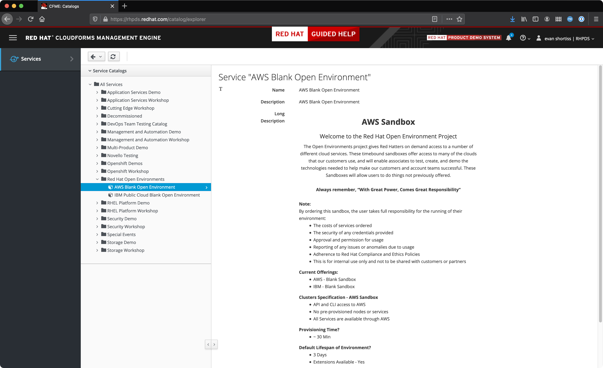
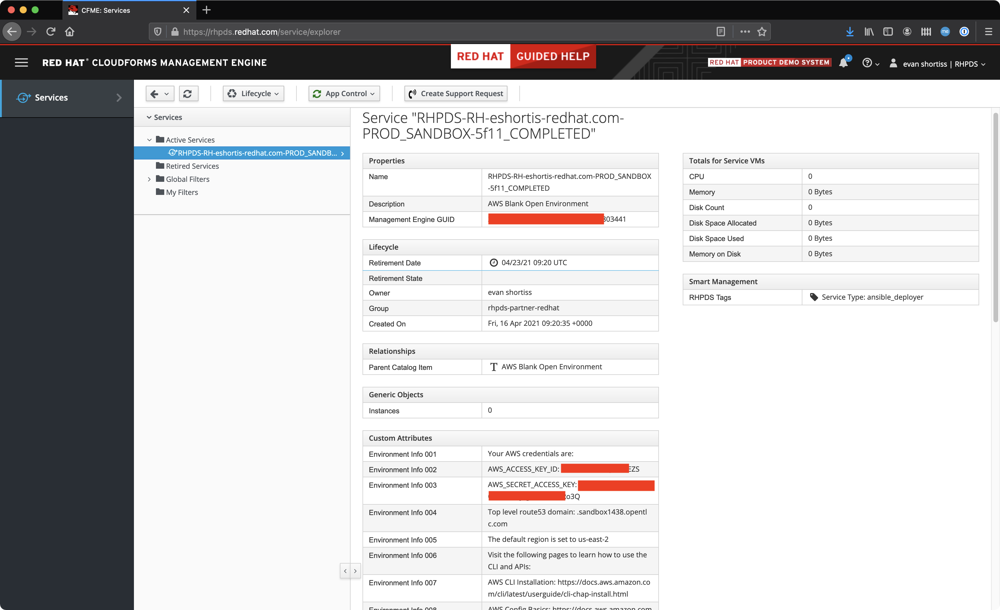
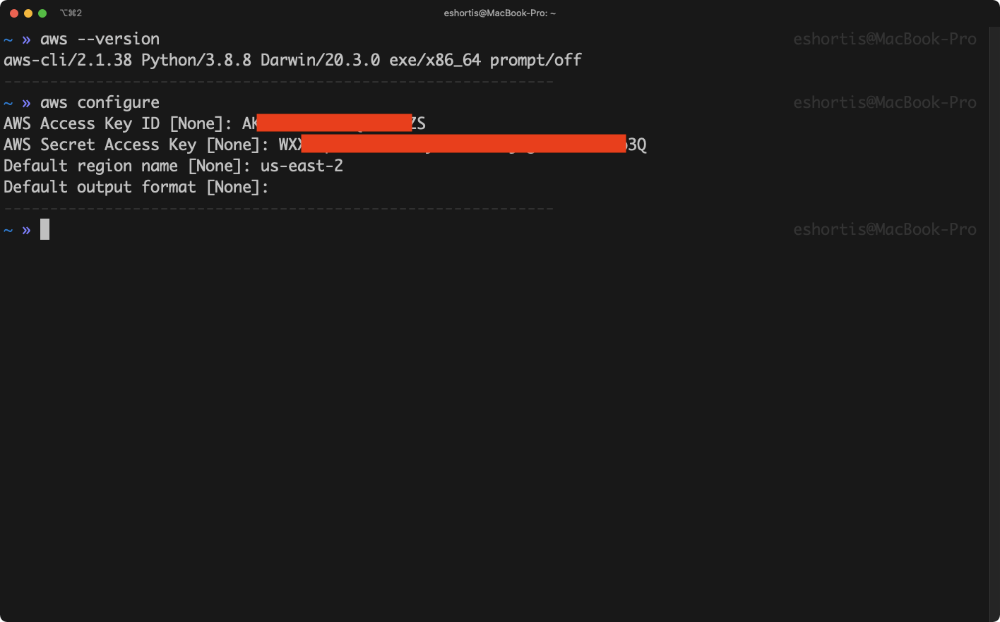
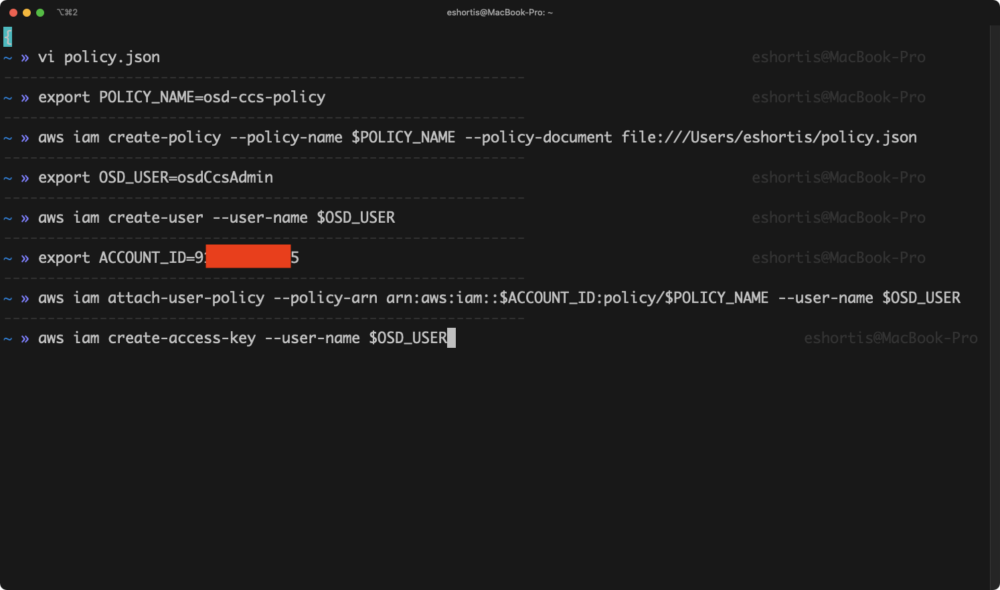
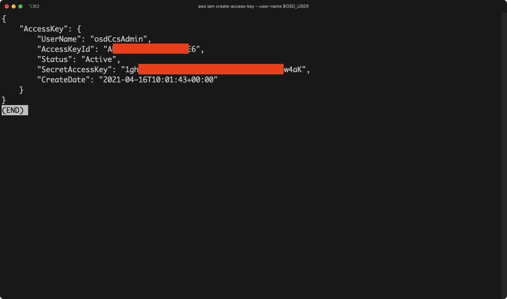
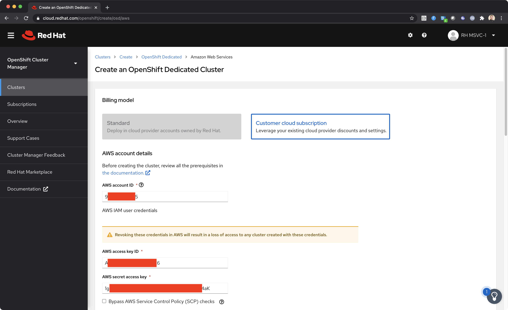

:standard-fail-text: Verify that you followed all the steps. If you continue to have issues, contact a workshop assistant.
:namespace: {user-username}
:idp: GitHub
:ocm-url: https://cloud.redhat.com
:osd-name: OpenShift Dedicated
:osd-acronym: OSD
:rhoam-name: Red Hat OpenShift API Management
:rhoam-acronym: RHOAM
:3scale-name: 3scale API Management
:sso-name: Single Sign-On

= Create and Configure an {osd-name} Cluster

[NOTE]
====
This is lab is optional. The instructor may have already completed this on your behalf. Check with your instructor before attempting to completing this section.
====

{rhoam-name} must be installed into an existing {osd-name} cluster.

This lab will guide you through the process of creating a link:https://www.openshift.com/dedicated/ccs[Customer Cloud Subscription (CCS)] that allows Red Hat to deploy and manage resources for an OpenShift Dedicated ({osd-acronym}) cluster in a given cloud vendor account.

Once this OpenShift Dedicated cluster is created you will be able to apply the {rhoam-name} ({rhoam-acronym}) addon on it to use API Management features.

== Obtaining an AWS Account

We will be using an AWS Account for the purposes of this lab.

=== Using RHPDS

[NOTE]
====
These instructions are only applicable for Red Hat employees or partners with RHPDS access and the relevant entitlements for the listed catalog item(s).

If you believe you should be able to, cannot obtain an AWS environment using these steps please reach out to the workshop administrator(s).
====

. Login to link:https://rhpds.redhat.com/[RHPDS].
. Select *Services > Catalogs* from the side-menu.
. Expand the *Red Hat Open Environments* and select *AWS Blank Open Environment*.
. Scroll down and click *Order*.
+

. Check the box confirm you understand the warnings.
. Select *Training - As part of a course* for the *Purpose*.
. Enter an *Opportunity Number/ID or Campaign ID* if necessary.
. Click *Submit*.

The environment will start provisioning. It should be ready after a couple of minutes. Verify it was successful using the following steps:

. Select *Services > My Services* from the RHPDS side-menu.
. Verify that an entry is listed under *Active Services*.
. Select the entry from the *Active Services* list and confirm that:
.. The *Name* ends with `COMPLETED`, e.g `RHPDS-RH-yourusername-redhat.com-PROD_SANDBOX-5f11_COMPLETED`.
.. The *Custom Attributes* section contains an *AWS_ACCESS_KEY_ID* and *AWS_SECRET_ACCESS_KEY*.

If your environment is not ready then wait a few minutes and refresh the RHPDS UI. Contact your lab administrator(s) if the environment fails to become ready.

=== Using a Personal/Custom AWS Environment

Obtaining an AWS Environment from a source other than AWS is supported, but outside the current scope of these instructions.

== Setup the AWS CLI

The AWS CLI is required to prepare the AWS Account for use with CCS. Use the instructions at this link to link:https://docs.aws.amazon.com/cli/latest/userguide/install-cliv2.html[install AWS CLI v2] on your system.

Once the CLI has been installed verify the installation by issuing an `aws --version` command. You should see output similar to this:

----
aws-cli/2.1.38 Python/3.8.8 Darwin/20.3.0 exe/x86_64 prompt/off
----

Next, configure the AWS CLI using the `aws configure` command. This requires an *Access Key ID* and *Secret Access Key*.

This lab assumes you're using an RHPDS account with the *Red Hat Open Environments > AWS Blank Open Environment* provisioned. As a result you'll have access to these two pieces of information from the RHPDS UI. If you're not using RHPDS then you'll need to follow the link:https://docs.aws.amazon.com/cli/latest/userguide/cli-configure-quickstart.html#cli-configure-quickstart-config[AWS guide here].

Once you have the *Access Key ID* and *Secret Access Key* use them to configure the AWS CLI per the following screenshot. The chosen region is `us-east1` since this is the default region for RHPDS.

== Create an AWS IAM Policy for CCS

The OpenShift Cluster Manager on link:{ocm-url}[cloud.redhat.com] requires a user named *osdCcsAdmin* to provision the OpenShift Dedicated resources into your AWS Account - this is described on the *Customer Procedure* section of the link:https://www.openshift.com/dedicated/ccs[Customer Cloud Subscription (CCS)] page.

Here's how you can create this policy and user via the AWS CLI. A screenshot summary is included below.

1. Create a file that contains this JSON:
+
----
{
    "Version": "2012-10-17",
    "Statement": [
        {
            "Action": "*",
            "Resource": "*",
            "Effect": "Allow"
        }
    ]
}
----
2. Create an IAM Policy using the file
+
----
export POLICY_NAME=osd-ccs-policy

# Note that the file:// prefix is necessary to reference your
# file that contains the JSON policy definition
aws iam create-policy --policy-name $POLICY_NAME --policy-document file:///Users/yourusername/policy.json
----
3. The new policy details will be printed in your terminal. Press the `Q` key to dismiss them.
4. Create the *osdCcsAdmin* user:
+
----
export OSD_USER=osdCcsAdmin

aws iam create-user --user-name $OSD_USER
----
5. Press `Q` to dismiss the new user details.
6. Obtain the *AWS Account ID* using the `aws sts get-caller-identity` command.
7. Attach the policy to the this new user using the Account ID:
+
----
export ACCOUNT_ID=<replace-me>
aws iam attach-user-policy --policy-arn arn:aws:iam::$ACCOUNT_ID:policy/$POLICY_NAME --user-name $OSD_USER
----
8. Lastly, create a new *Access Key ID* and *Secret Access Key* for the *osdCcsAdmin* user:
+
----
aws iam create-access-key --user-name $OSD_USER
----
+

9. Do not lose the output from the `aws iam create-access-key --user-name osdCcsAdmin` command! You'll need it in the next section.

== Provision the {osd-name} Cluster

=== Verify Subscription Quota

It's important to verify your quota prior to attempting to create the cluster using OpenShift Cluster Manager. Here's how to do that.

. Navigate to the OpenShift Cluster Manager at link:{ocm-url/openshift}[cloud.redhat.com/openshift]
. Select *Subscriptions* from the side-menu.
. Verify that you have active subscriptions for an {osd-acronym} Cluster, {osd-acronym} nodes, and the and {rhoam-acronym} addon.

Your quota should appear similar to the following screenshot.

image::images/lab0-ocm-subs.png[OpenShift Cluster Manager Subscriptions Summary, role="integr8ly-img-responsive"]

[NOTE]
====
Let your lab instructor know if your quota appears to be missing, or is significantly different to the screenshot.
====

=== Provisioning an {osd-name} Cluster on AWS

. Navigate to the OpenShift Cluster Manager at link:{ocm-url/openshift}[cloud.redhat.com/openshift]
. Click the *Create* cluster button beside *Red Hat {osd-name}*.
+
image::images/lab0-ocm-create-0.png[OpenShift Cluster Manager Create, role="integr8ly-img-responsive"]
. Choose AWS as the infrastructure provider
+
[NOTE]
====
A prompt to accept Terms and Conditions might appear. You must accept the Terms and Conditions to continue, so go ahead and do that if asked.

A second prompt explaining the *Customer cloud subscription* may also be displayed. Feel free to read and dismiss it. We'll cover what it explains in this lab.
====
. The *Customer cloud subscription* option should be pre-selected for *Billing model*. If not, select it.
. Populate the following *AWS Account details* using the values from the setup you performed using the AWS CLI earlier:
.. AWS Account ID
.. AWS access key ID
.. AWS secret access key
. Under the *Cluster details*:
.. Enter a cluster name, e.g `yourname-cluster`.
.. Select the *Region* that matches what you used when following the `aws configure` instructions previously.
.. Leave the *Availability* set to *Single-zone*.
+

. Set the following options for *Scale*:
.. Choose *m5.xlarge* worker nodes
.. Set the *Worker node count* to *8*.
. Select *Basic* as the *Networking Configuration*.
. Select *Manual* for the *Cluster updates* option.
+
image::images/lab0-ocm-network-config.png[OpenShift Cluster Manager Create Network Config, role="integr8ly-img-responsive"]
. Click *Create cluster*.

At this point the {osd-name} Cluster will start provisioning. This can take up to 30 minutes. In the meantime you can configure OAuth access to the cluster!

image::images/lab0-ocm-installing.png[OpenShift Cluster Manager InstallCreating Cluster, role="integr8ly-img-responsive"]

== Configure Cluster Access Management

Access to {osd-name} Clusters is managed using external IdPs. The following options are supported:

* LDAP
* GitHub & GitHub Enterprise
* Google
* OpenID Connect

For the purpose of this lab we'll configure a GitHub IdP. You need a GitHub account to do this.

[NOTE]
====
You can read more about cluster authentication in the link:https://docs.openshift.com/dedicated/4/authentication/dedicated-understanding-authentication.html[documentation here].
====

=== Create a GitHub Organisation

To get started, you'll need to create a GitHub Organisation. If you already have one that you'd like to use, then feel free to skip this step.

. Login to your account on link:https://github.com/[github.com].
. Navigate to the link:https://github.com/organizations/plan[create organisation page] and choose the free plan.
. Enter a name for the organisation.
. Enter your contact email address.
. Select *My personal account* when asked who the organisation belongs to. The complete form will look similar to this:
+
image::images/lab0-gh-org-create.png[GitHub Org Creation, role="integr8ly-img-responsive"]
. Click *Next* and follow the steps complete the process.
. After the organisation has been created add any users you'd like to use with your {osd-acronym} cluster to it. You can do this using the *Invite someone* button. Make sure to invite your own GitHub user account!
+
image::images/lab0-gh-invite.png[GitHub Org Invite, role="integr8ly-img-responsive"]

=== Add GitHub Authentication to the Cluster

. Navigate to the OpenShift Cluster Manager at link:{ocm-url/openshift}[cloud.redhat.com/openshift].
. Select your cluster from the list. The cluster details will be displayed.
. Select the *Access control* tab form the cluster details.
. Click the *Add identity provider* button. A dialog will appear.
. Choose *GitHub* from the *Identity Provider* dropdown.
. Enter a name. Entering just "GitHub" is fine.
. Copy the *OAuth callback URL*, and leave the dialog open.
. Open another browser tab/window, and use it to navigate to your GitHub organisation. If you lost your organisation URL you can find it at link:https://github.com/settings/organizations[github.com/settings/organizations].
. Select *Settings* from the organisation homepage.
. Scroll down and click *Developer Settings > OAuth Apps* from the side-menu.
. Click the *New OAuth App* button in the top-right.
+
image::images/lab0-gh-new-app.png[GitHub New OAuth App, role="integr8ly-img-responsive"]
. Enter an *Application name*.
. Any URL can be used as the homepage URL, but enter "https://cloud.redhat.com" for the time being.
. Paste the URL you copied into the *Authorization callback URL* field on cloud.redhat.com.
. Click the *Register application* button. You should be redirected to your application's page.
+
image::images/lab0-gh-oauth-app.png[GitHub OAuth application, role="integr8ly-img-responsive"]
. Copy the *Client ID* from this page and paste it into the corresponding field on cloud.redhat.com.
. Return to the GitHub application page and click the *Generate a new client secret* button.
. Copy the secret and paste it into the corresponding field on cloud.redhat.com.
. Click *Confirm* in the cloud.redhat.com dialog.

You now have an IdP configured and can login to your {osd-name} cluster once the provisioning has completed.

[NOTE]
====
It can take 1-2 minutes for the IdP settings to synchronise with the {osd-name} cluster. If you click *Open Console* to view the {osd-name} Console and don't see your IdP listed then you'll need to wait a minute and refresh the page.
====

=== Add Cluster Administrative Users

All users that login using the configured IdP (GitHub in this case) are regular users by default. This lab requires you to make yourself a *dedicated-admin*.

You can read more about users and roles in the link:https://docs.openshift.com/dedicated/4/administering_a_cluster/dedicated-admin-role.html[{osd-acronym} Documentation].

Follow these steps to apply the *dedicated-admin* role to your user:

. Navigate to the OpenShift Cluster Manager at link:{ocm-url/openshift}[cloud.redhat.com/openshift]
. Select your cluster from the list.
. Select the *Access control* section.
. Click the *Add user* button. A dialog should appear.
. Enter your _GitHub username_ (because you're using GitHub as an IdP) and select the *dedicated-admins* group.
. Click the *Add user* button to save the change.

Your GitHub user is a *dedicated-admin* now.

== Login to the Cluster

TODO
