:standard-fail-text: Verify that you followed all the steps. If you continue to have issues, contact a workshop assistant.
:namespace: {user-username}
:idp: GitHub
:ocm-url: https://cloud.redhat.com
:osd-name: OpenShift Dedicated
:osd-acronym: OSD
:rhoam-name: Red Hat OpenShift API Management
:rhoam-acronym: RHOAM
:3scale-name: 3scale API Management
:sso-name: Single Sign-On

= Create and Configure an {osd-name} Cluster

{rhoam-name} must be installed into an existing {osd-name} cluster.

This lab will guide you through the process of creating a link:https://www.openshift.com/dedicated/ccs[Customer Cloud Subscription (CCS)] that allows Red Hat to deploy and manage resources for an OpenShift Dedicated ({osd-acronym}) cluster in a given cloud vendor account.

Once this OpenShift Dedicated cluster is created you will be able to apply the {rhoam-name} ({rhoam-acronym}) addon on it to use API Management features.

== Obtaining an AWS Account

You will need to use an AWS Account for the purposes of this lab. You have three options to obtain one:

. Provided by a lab instructor
. Bring your own account
. Obtained using your RHPDS Account

Please talk to your lab instructor if you're unsure about which of these applies to you. Each option is described in detail below.

=== Lab Instructor Provided Account

Your lab instuctor will provide you with a link, *Lab Code*, and *Activation Key* that you can use to obtain an AWS Account.

. Open the link in your web browser.
. Select the correct *Lab Code* from the dropdown.
. Enter the lab *Activation Key*.
. Enter your email address.
. Click the *Submit* button.

You will be redirected to a page that contains AWS Account credentials. Proceed to the *Setup the AWS CLI* section from here.

== Setup the AWS CLI

The AWS CLI is required to prepare the AWS Account for use with CCS. Use the instructions at this link to link:https://docs.aws.amazon.com/cli/latest/userguide/install-cliv2.html[install AWS CLI v2] on your system.

Once the CLI has been installed verify the installation by issuing an `aws --version` command. You should see output similar to this:

----
aws-cli/2.1.38 Python/3.8.8 Darwin/20.3.0 exe/x86_64 prompt/off
----

Next, configure the AWS CLI using the `aws configure` command. This requires an *Access Key ID* and *Secret Access Key*.

This lab assumes you're using an RHPDS account with the *Red Hat Open Environments > AWS Blank Open Environment* provisioned. As a result you'll have access to these two pieces of information from the RHPDS UI. If you're not using RHPDS then you'll need to follow the link:https://docs.aws.amazon.com/cli/latest/userguide/cli-configure-quickstart.html#cli-configure-quickstart-config[AWS guide here].

Once you have the *Access Key ID* and *Secret Access Key* use them to configure the AWS CLI per the following screenshot. The chosen region is `us-east-2` since this is the default region for RHPDS.

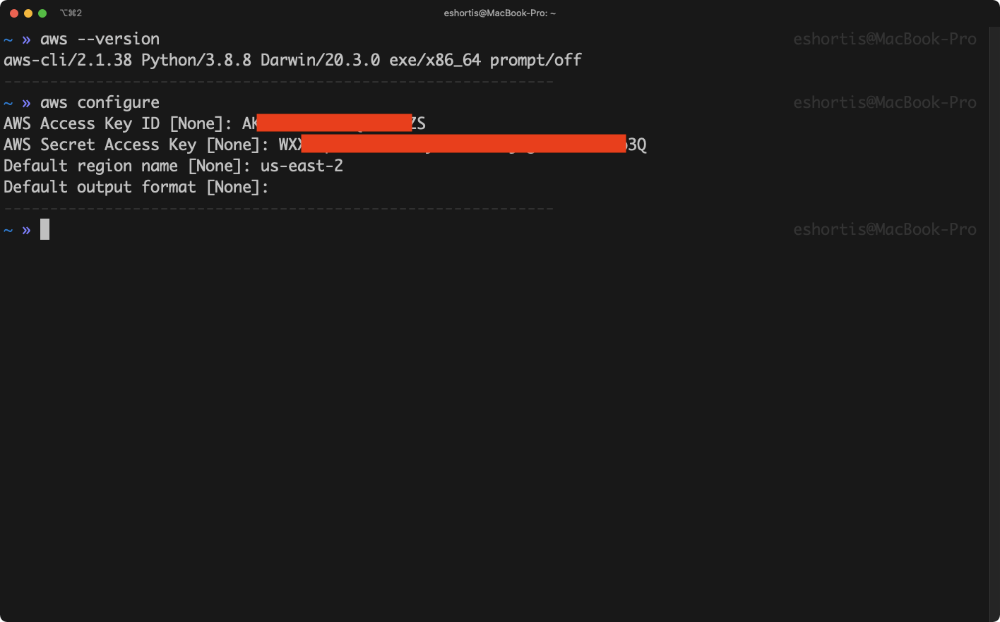

== Create an AWS IAM Policy for CCS

The OpenShift Cluster Manager on link:{ocm-url}[cloud.redhat.com] requires a user named *osdCcsAdmin* to provision the OpenShift Dedicated resources into your AWS Account - this is described on the *Customer Procedure* section of the link:https://www.openshift.com/dedicated/ccs[Customer Cloud Subscription (CCS)] page.

You can create this policy and user via the AWS CLI. A link:https://gist.github.com/evanshortiss/920e135688f89048e942bd8be0d56124[script]
is provided to complete this step since it involves typing a few commands.

Review the script, then run it using the following command:

----
curl https://gist.githubusercontent.com/evanshortiss/920e135688f89048e942bd8be0d56124/raw/54a981077b320027f0b79ff715660097fccbce42/osd-ccs-admin-setup.sh | bash
----

[NOTE]
====
If you'd rather not run the script by piping to bash, simply download its content and run it locally instead. The end result will be the same.
====

The script will print the AWS Account ID along with an Access Key ID and Secret
Access Key once complete. Keep these safe, since they're required to create
a OSD cluster. An example of the script output is shown below.

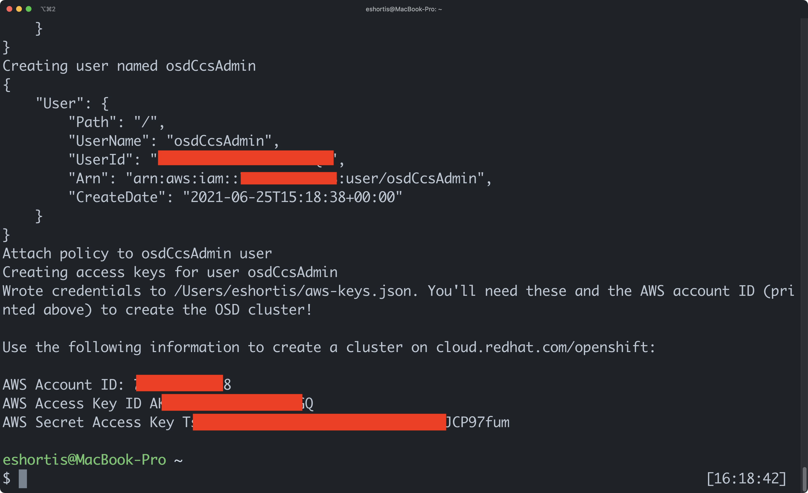

== Obtain a Red Hat Cloud Account

There are two ways to obtain an a lab account for {ocm-url}:

. Your lab instructor will provide one
. Signup for a trial account

If you lab instructor has not provided an account, you can sign up for one. All new accounts receive trial quota for {osd-acronym} and {rhoam-acronym}.

. Open link:{ocm-url}[cloud.redhat.com] in your web browser.
. Click the *Log in* button.
. Choose *Create one now* under the login form. This will direct you to the registration page.
. Select *Corporate* as the *Account type*.
. Enter a memorable username.
. Use your `@redhat.com` email address, but enter a link:https://support.google.com/a/users/answer/9308648?hl=en[task specific address]. For example, `jdoe+rhoam-lab@redhat.com` if your email is `jdoe@redhat.com`.
. Complete the form and click *Create my account*.

Follow any subsequent steps on {ocm-url} and verify your email address if required.

== Provision the {osd-name} Cluster

You're ready to provision an {osd-name} cluster now that you have an AWS Account and {ocm-url} account.

=== Verify Subscription Quota

It's important to verify your quota prior to attempting to create the cluster using OpenShift Cluster Manager. Here's how to do that.

. Navigate to the OpenShift Cluster Manager at link:{ocm-url}/openshift[cloud.redhat.com/openshift]
. Login using your lab account.
. Select *Subscriptions* from the side-menu.
. Verify that you have active subscriptions for an {osd-acronym} Cluster, {osd-acronym} nodes, and the and {rhoam-acronym} addon.

[NOTE]
====
The RHOAM Addon is currently not listed if you're using trial quota. This is OK, and you can still provision {osd-acronym} and {rhoam-acronym}.
====

Your quota should appear similar to the following screenshot.

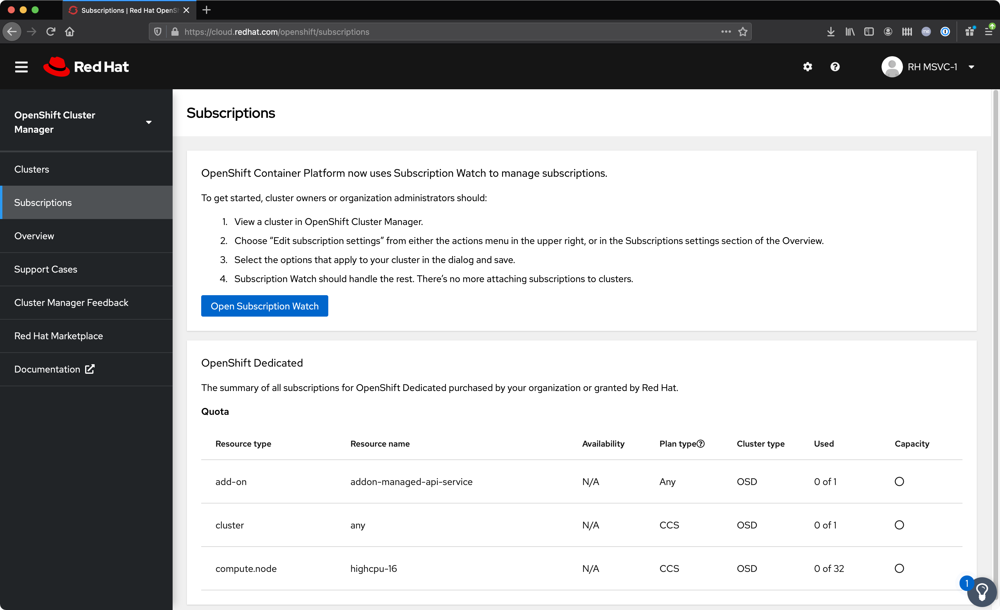

[NOTE]
====
Let your lab instructor know if your quota appears to be missing, or is significantly different to the screenshot.

If you have OSD Trial quota this is OK to use to complete the lab.
====

=== Provisioning an {osd-name} Cluster on AWS

. Navigate to the OpenShift Cluster Manager at link:{ocm-url}/openshift[cloud.redhat.com/openshift]
. Click the *Create cluster* or *Create trial cluster* button beside *Red Hat {osd-name}*.
+
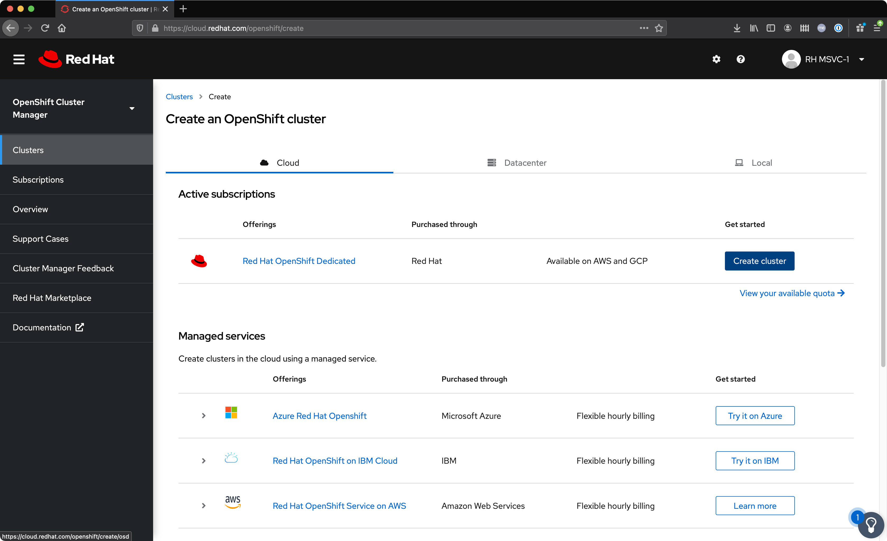
. Choose AWS as the infrastructure provider
+
[NOTE]
====
A prompt to accept Terms and Conditions might appear. You must accept the Terms and Conditions to continue, so go ahead and do that if asked. +
If you see an error page appearing,switch to a private browser window.

A second prompt explaining the *Customer cloud subscription* may also be displayed. Feel free to read and dismiss it. We'll cover what it explains in this lab.
====
. The *Customer cloud subscription* option should be pre-selected for *Billing model*. If not, select it.
. Populate the following *AWS Account details* using the values from the setup you performed using the AWS CLI earlier. Use the AWS Access key and secret from the `osdCcsAdmin` user you created previously:
.. AWS Account ID
.. AWS access key ID
.. AWS secret access key
. Under the *Cluster details*:
.. Enter a cluster name, e.g `yourname-cluster`.
.. Select the *Region* that matches what you used when following the `aws configure` instructions previously.
.. Leave the *Availability* set to *Single-zone*.
+
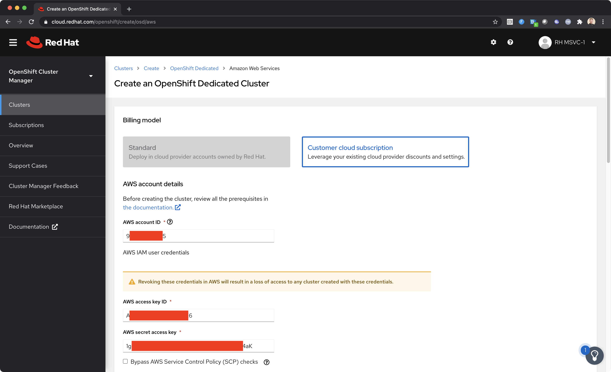
. Use the following options for *Scale*:
.. Choose *m5.xlarge* worker nodes
.. Set the *Worker node count* to *6*.
. Select *Basic* as the *Networking Configuration*.
. Select *Manual* for the *Cluster updates* option.
+
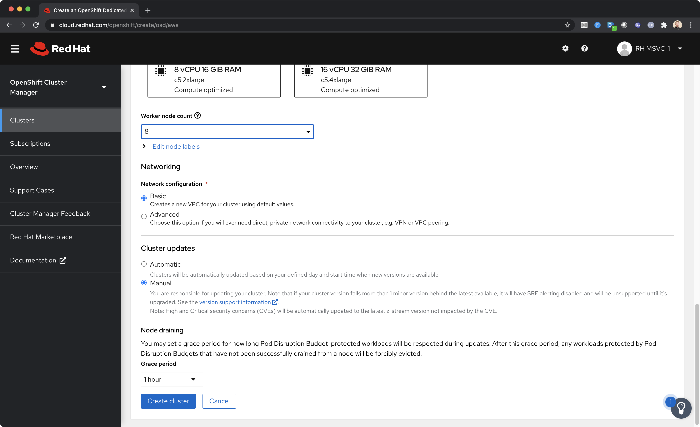
. Click *Create cluster*.

At this point the {osd-name} Cluster will start provisioning. This can take up to 30 minutes. In the meantime you can configure OAuth access to the cluster!

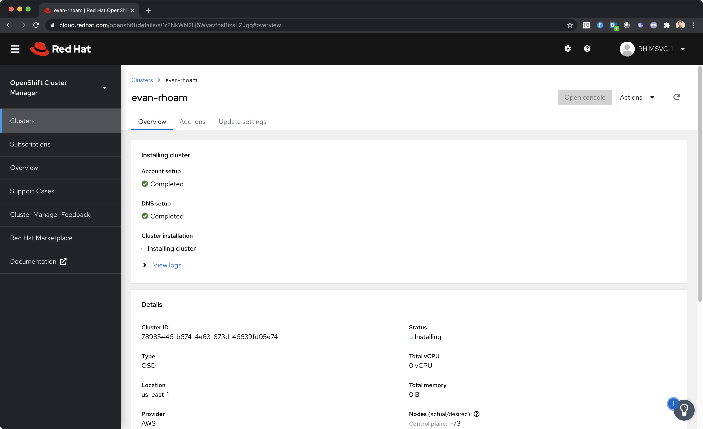

== Configure Cluster Access Management

Access to {osd-name} Clusters is managed using external IdPs. The following options are supported:

* LDAP
* GitHub & GitHub Enterprise
* Google
* OpenID Connect

For the purpose of this lab we'll configure a GitHub IdP. You need a GitHub account to do this.

[NOTE]
====
You can read more about cluster authentication in the link:https://docs.openshift.com/dedicated/4/authentication/dedicated-understanding-authentication.html[documentation here].
====

=== Create a GitHub Organisation

To get started, you'll need to create a GitHub Organisation. If you already have one that you'd like to use, then feel free to skip this step.

. Login to your account on link:https://github.com/[github.com].
. Navigate to the link:https://github.com/organizations/plan[create organisation page] and choose the free plan.
. Enter a name for the organisation.
. Enter your contact email address.
. Select *My personal account* when asked who the organisation belongs to. The complete form will look similar to this:
+
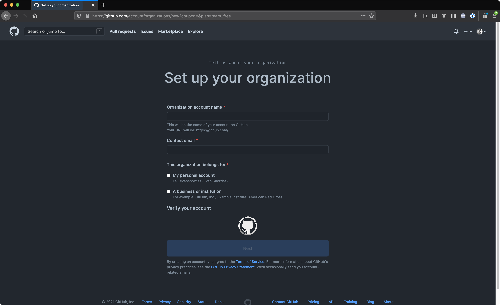
. Click *Next* and follow the steps complete the process.
. After the organisation has been created add any users you'd like to use with your {osd-acronym} cluster to it. You can do this using the *Invite someone* button. Make sure to invite your own GitHub user account!
+
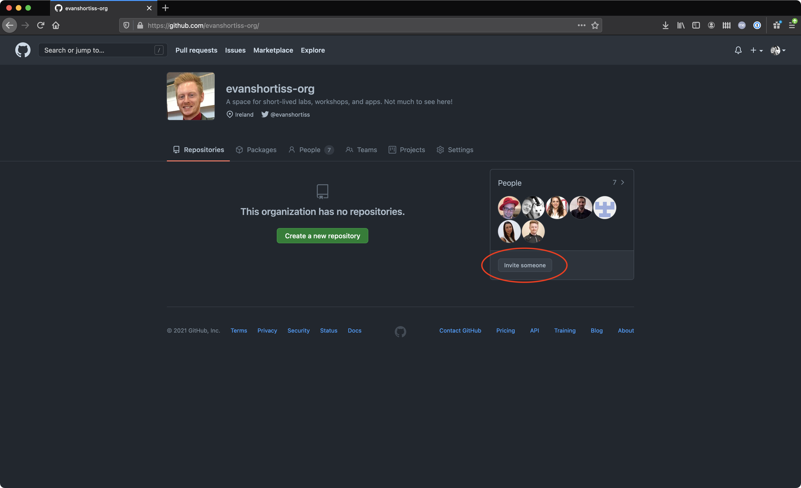

=== Add GitHub Authentication to the Cluster

. Navigate to the OpenShift Cluster Manager at link:{ocm-url}/openshift[cloud.redhat.com/openshift].
. Select your cluster from the list. The cluster details will be displayed.
. Select the *Access control* tab form the cluster details.
. Click the *Add identity provider* button. A dialog will appear.
+
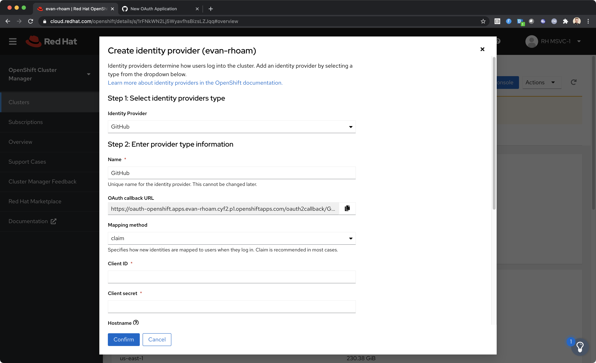
. Choose *GitHub* from the *Identity Provider* dropdown.
. Enter a name. Using the default "GitHub" value is OK.
. Copy the *OAuth callback URL*, and leave the dialog open.
. Open another browser tab/window, and use it to navigate to your GitHub organisation. If you lost your organisation URL you can find it at link:https://github.com/settings/organizations[github.com/settings/organizations].
. Select *Settings* from the organisation homepage.
. Scroll down and click *Developer Settings > OAuth Apps* from the side-menu.
. Click the *New OAuth App* button in the top-right.
+
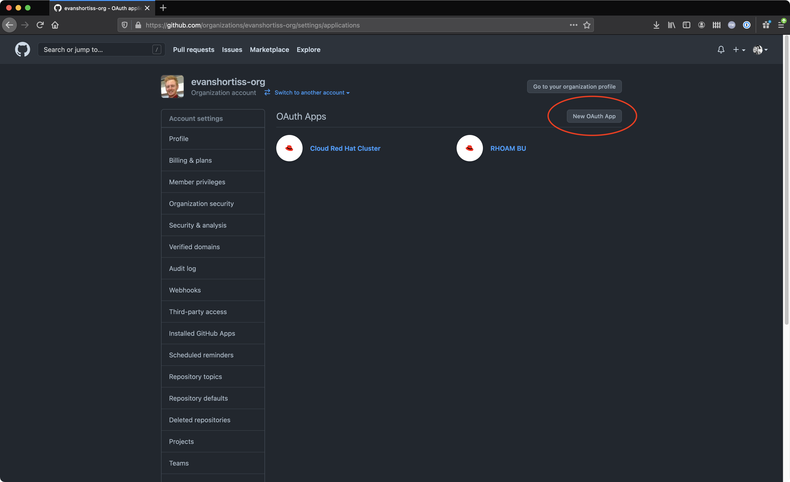
. Enter an *Application name*.
. Any URL can be used as the homepage URL, but enter `https://cloud.redhat.com` for the time being.
. Paste the URL you copied from *cloud.redhat.com* into the *Authorization callback URL* field.
. Click the *Register application* button. You should be redirected to your application's page.
+
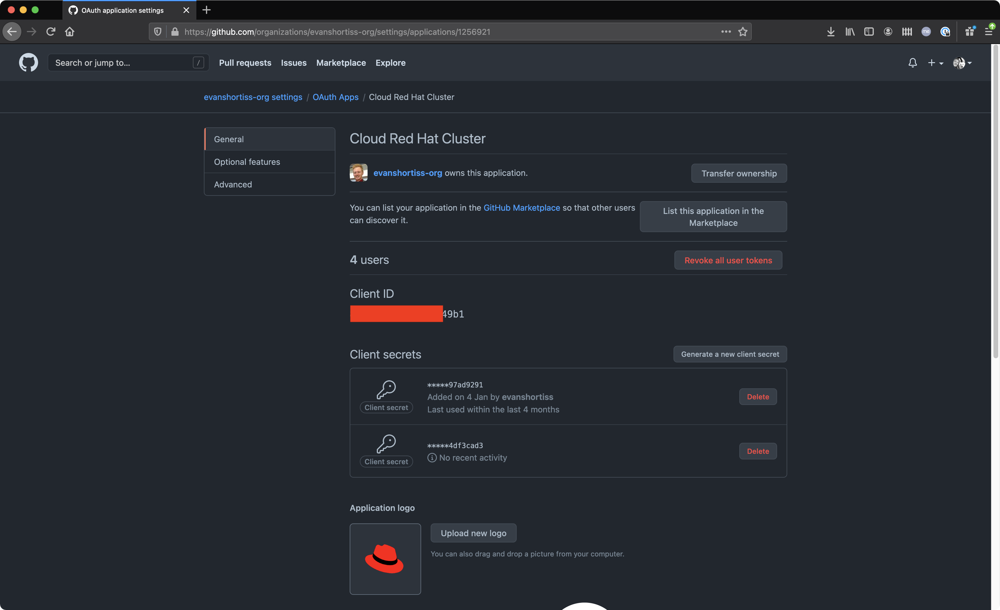
. Copy the *Client ID* from this page and paste it into the corresponding field on cloud.redhat.com.
. Return to the GitHub application page and click the *Generate a new client secret* button.
. Copy the secret and paste it into the corresponding field on cloud.redhat.com.
. Scroll to the bottom of the *Create identity provider* dialog on *cloud.redhat.com* and select *Use organizations*.
+
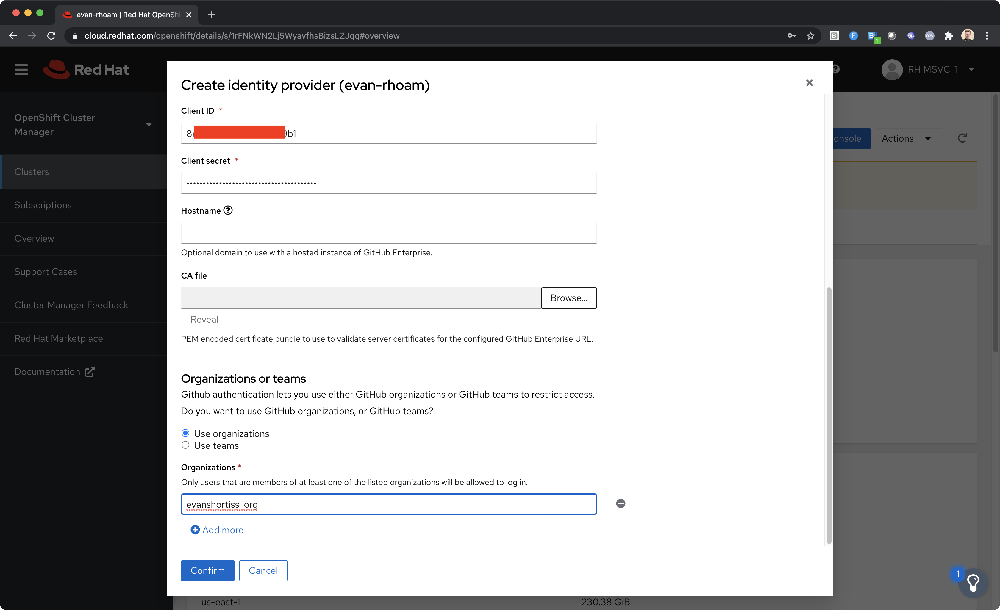
. Enter your organization name into the *Organizations* input field.
. Click *Confirm* in the cloud.redhat.com dialog.

You now have an IdP configured and can login to your {osd-name} cluster once the provisioning has completed. Test this using the following steps.

1. Select your cluster on link:https://cloud.redhat.com[cloud.redhat.com/openshift].
2. Click the blue *Open console* button in the top-right corner.
3. Verify that your GitHub IdP is listed as shown.
+
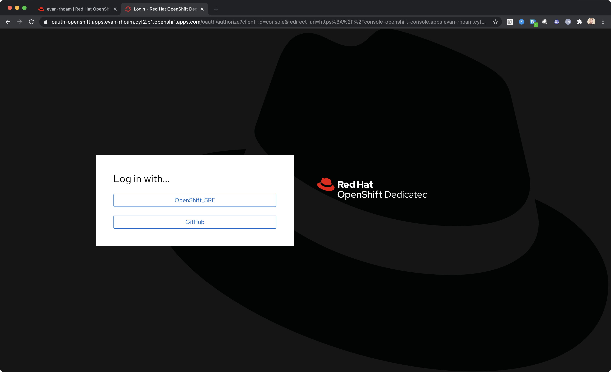
4. Select your IdP and login using the GitHub OAuth flow.

[NOTE]
====
It can take 1-2 minutes for the IdP settings to synchronise with the {osd-name} cluster. If you don't see your IdP listed on the login screen then you'll need to wait a minute and refresh the page.
====

=== Add Cluster Administrative Users

All users that login using the configured IdP (GitHub in this case) are regular users by default. This lab requires you to make yourself a *dedicated-admin*.

You can read more about users and roles in the link:https://docs.openshift.com/dedicated/4/administering_a_cluster/dedicated-admin-role.html[{osd-acronym} Documentation].

Follow these steps to apply the *dedicated-admin* role to your user:

. Navigate to the OpenShift Cluster Manager at link:{ocm-url}/openshift[cloud.redhat.com/openshift]
. Select your cluster from the list.
. Select the *Access control* section.
. Click the *Add user* button. A dialog should appear.
+
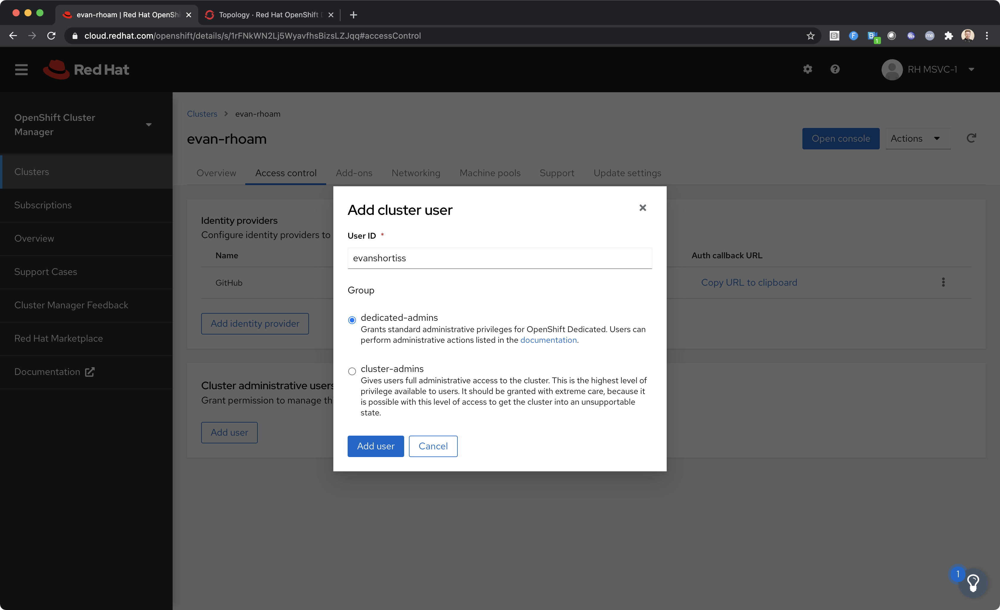
. Enter your GitHub username (because GitHub is the IdP in-use) and select the *dedicated-admins* group.
. Click the *Add user* button to save the change.

You are *dedicated-admin* now. Verify this by logging into the cluster and confirming that you can view the *OperatorHub* and namespaces that require elevated privileges as shown.

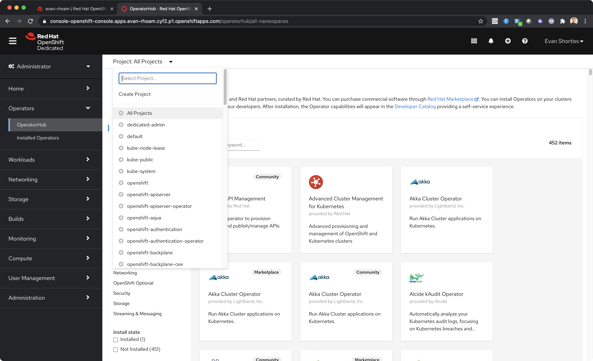

== Congratulations

You've provisioned an {osd-name} cluster and configured access to it via an external IdP!

Time for the next lab.
