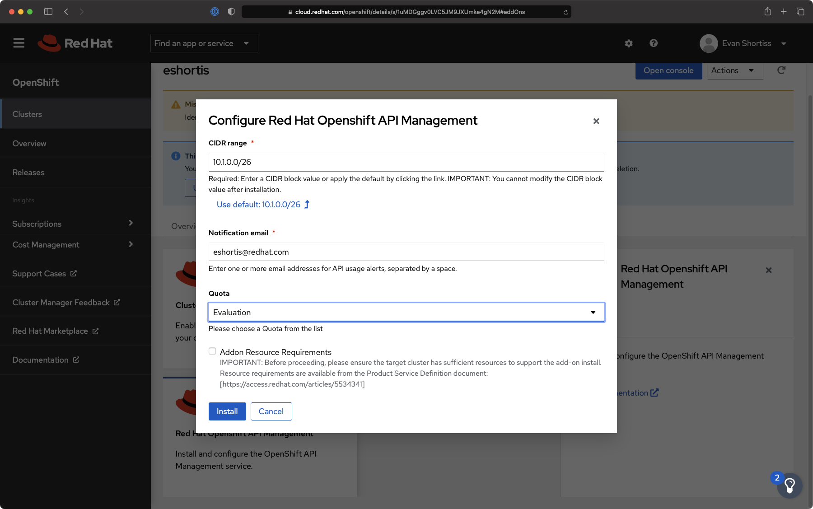
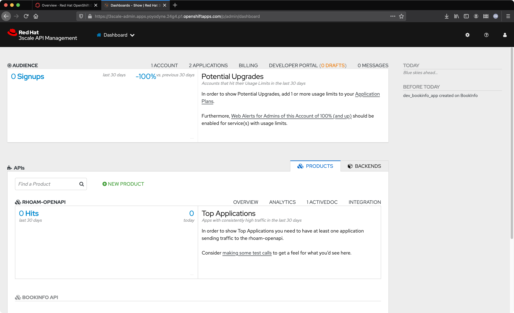
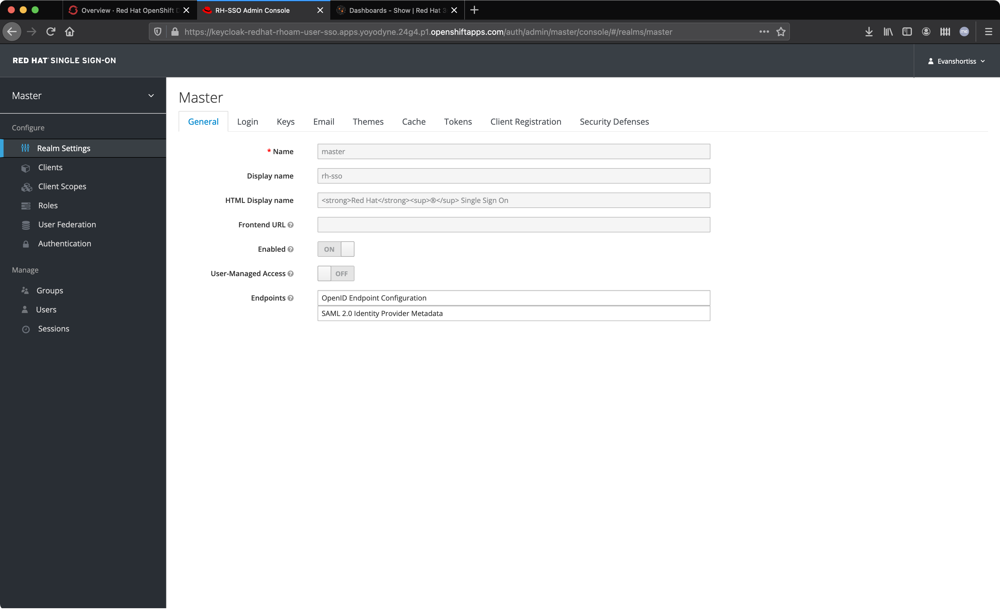
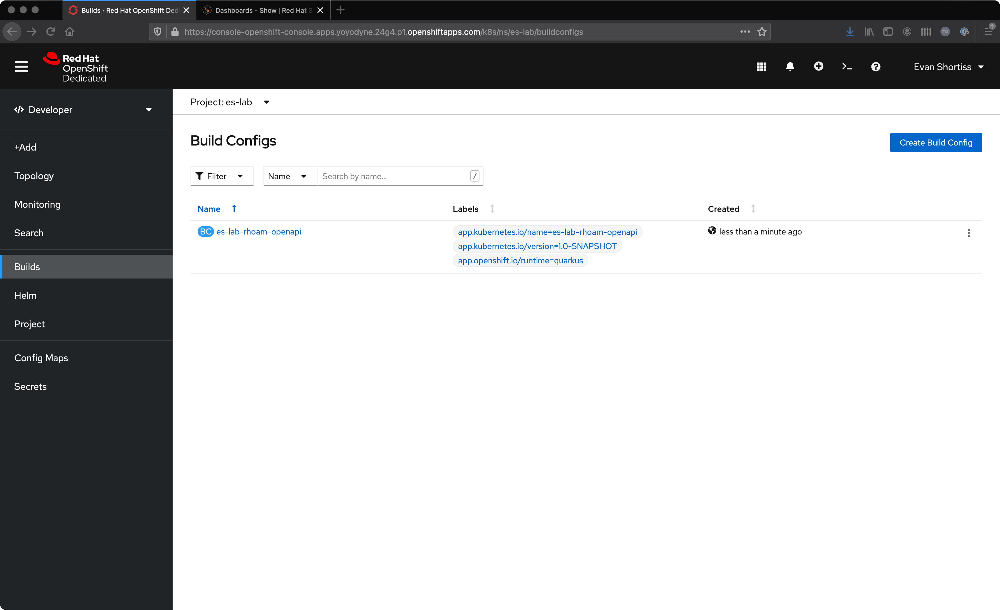

:standard-fail-text: Verify that you followed all the steps. If you continue to have issues, contact a workshop assistant.
:namespace: {user-username}
:idp: GitHub
:ocm-url: https://cloud.redhat.com
:osd-name: OpenShift Dedicated
:osd-acronym: OSD
:rhoam-name: Red Hat OpenShift API Management
:rhoam-acronym: RHOAM
:3scale-name: 3scale API Management
:sso-name: Single Sign-On

= Red Hat OpenShift API Management Introduction & Install

This lab provides an introduction to {rhoam-name}, also known as {rhoam-acronym}. If you're already familiar with Red Hat {osd-name}, Red Hat {3scale-name} and Red Hat {sso-name} you'll immediately feel at home using {rhoam-acronym}.

{rhoam-acronym} is {3scale-name} delivered as an addon for
{osd-name} ({osd-acronym}). Both {osd-acronym}, and the {rhoam-acronym} addon
running on top of it, are managed by Red Hat SRE and have a 99.95% SLA. The
following image provides a high-level overview of the {rhoam-acronym} architecture:

image::images/basic-architecture.png[architecture, role="integr8ly-img-responsive"]

However, since {rhoam-acronym} is a hosted an managed service there's a little more to it than that picture shows.
{rhoam-acronym} clusters are provisioned and managed using Red Hat OpenShift Cluster Manager on link:{ocm-url}[cloud.redhat.com, window="_blank"].
Operators are installed on the {osd-acronym} to manage the {rhoam-acronym} product lifecycle, and keep SRE teams informed of the cluster and service health. A more detailed architectural representation of this is pictured below.

image::images/detailed-architecture.png[detailed architecture, role="integr8ly-img-responsive"]

It is assumed you have access to a {rhoam-acronym} environment from this point forward.
You can get access by:

. Requesting it from a lab instructor if you're following this content as part of an instructor led lab.
. Provisioning an environment of your own at link:{ocm-url}[cloud.redhat.com, window="_blank"] using the following instructions:
.. link:{https://access.redhat.com/documentation/en-us/red_hat_openshift_api_management/1/}[Official Documentation]
.. link:{https://www.youtube.com/watch?v=sd2TlBm5KHs}[Video Instructions]

Verify you have a development environment with the following configured before continuing:

* OpenShift (`oc`) CLI v4.6.x
* Git CLI
* Local Java environment with Maven installed

== Installing the {rhoam-acronym} Add-on

. Login to link:{ocm-url}[cloud.redhat.com, window="_blank"].
. Navigate to the link:{ocm-url/openshift/}[clusters list, window="_blank"].
. Select the {osd-name} cluster you plan to install {rhoam-acronym} onto.
. Navigate to the *Add-ons* tab.
+
image::images/lab1-addon-tile.png[RHOAM Addon tile in Add-ons UI]
. Click the *Install* button on the {rhoam-name} tile.
. A dialog asking for *CIDR range* and *Notification email* are displayed.
+

. Click the *Use default* link for the CIDR range.
+
[NOTE]
====
We're using the default CIDR range since we chose the basic networking configuration when creating the cluster used in this lab. It may be necessary to specify a different CIDR range if you had chosen advanced networking.
====
. Enter your email address in the *Notification email* field.
[NOTE]
====
This email address will receive notifications when the API Management service utilisation approaches limits defined in the SKU.
====
. Click the *Install* button.

The installation process can take up to 30 minutes.

[time=5]
[id='accessing-the-cluster']
:sectnums:
==  Accessing your Environment

[NOTE]
====
You can skip this section if you did not provision your own environment.
====

If you've provisioned your own environment you can access the OpenShift console using the following steps:

. Login to link:{ocm-url}[cloud.redhat.com, window="_blank"].
. Navigate to the link:{ocm-url/openshift/}[clusters list, window="_blank"].
. Select the cluster that has the {rhoam-name} addon installed.
. Click the *Open Console* button from the Overview screen.

A screenshot of the Overview screen is provided for reference.

image::images/lab1-console-url.png[Cluster Overview, role="integr8ly-img-responsive"]

Once you've been provided with a URL to your environment, you will be able to login using a configured IdP (identity provider).
Any available IdPs are listed on the OpenShift login screen as shown in the following screenshot.

image::images/lab1-login.png[OpenShift Login Screen, role="integr8ly-img-responsive"]

Choose the appropriate IdP and login. You should be redirected to the {osd-name} console.

image::images/lab1-osd-console.png[OpenShift Console, role="integr8ly-img-responsive"]

Documentation for {osd-name} IdP configuration is available at link:https://docs.openshift.com/dedicated/4/authentication/dedicated-understanding-authentication.html[this link].

== Accessing Red Hat {3scale-name} and Red Hat {sso-name}

If the {rhoam-name} Add-on has completed installation you can login into your {osd-acronym} cluster, and you can access the managed {3scale-name} and {sso-name} instances.

You can confirm the Add-on installation is complete by checking the Add-ons tab in OpenShift Cluster Management as shown.

image::images/lab1-addon-status.png[Add-on Status in OCM]

[NOTE]
====
At the time of writing there is a known issue that may cause the Add-on to report a status of "Installed" prior to completion. Be patient with this and check the *Installed Operators* page to confirm that the various operators have finished installing.
====

The procedure to access the consoles is the same for both {3scale-name} and {sso-name}.

. Click the *Application Launcher* icon in the {osd-name} console. This the square icon in the top-right.
. Select *API Management* to access {3scale-name}, or *API Management SSO* to access {sso-name}.
. A new browser tab will open and prompt you to login. Login using your IdP.
. You will be redirected to the applicable product console after successfully authenticating with your IdP.

This is a screenshot the {3scale-name} console:

And this is a screenshot of the {sso-name} console:

== Create and Deploy a Project on {osd-name}

As part of this lab you'll deploy a Quarkus application for use in future labs.
To deploy the Quarkus application you must first create a project.
Here's how to do that:

. Navigate to the {osd-name} Console.
. Click your name in the top-right, then click *Copy Login Command*.
. Login using your IdP, and click *Display Token*.
. Copy the `oc login` command and paste it into a terminal in your local development environment.

You should be successfully logged in and able to use the OpenShift CLI now.
Verify this by creating a project using the following commands:

----
# change this to be unique using your name
export PROJECT_NAME=yourname-lab

oc new-project $PROJECT_NAME
----

Here's an image showing these commands running in a terminal:

image::images/lab1-oc-project.png[Using oc CLI to create a project, role="integr8ly-img-responsive"]

== Test the Quarkus Application and Deploy to {osd-name}

Get started by cloning the link:{https://github.com/evanshortiss/rhoam-quarkus-openapi}[Quarkus application Git repository] to your development environment.

----
git clone https://github.com/evanshortiss/rhoam-quarkus-openapi
----

Run and test the application locally:

. Start the development server using `./mvnw quarkus:dev`
. Visit link:http://localhost:8080/fruits[localhost:8080/fruits].
. Verify that a list of fruits is returned in JSON format.
. Visit link:http://localhost:8080/openapi?format=json[localhost:8080/openapi?format=json] to verify that an OpenAPI Spec is returned.

If all is working as expected, deploy the application using the following commands:

----
oc project $PROJECT_NAME

# Note $PROJECT_NAME must be set for this next command to work!
./mvnw clean package -Dquarkus.kubernetes.deploy=true -Dquarkus.openshift.expose=true
----

The build process can take up to 2 minutes.
You can view the Build logs by visiting the *Builds* section of your project as shown.

Once the build is complete issue the `oc get route -n $PROJECT_NAME` command to find the URL for your Quarkus application.
Verify that the `/fruits` and `/openapi?format=json` endpoints are working as expected since these are required for the next lab.

You're now ready for Lab 2!
