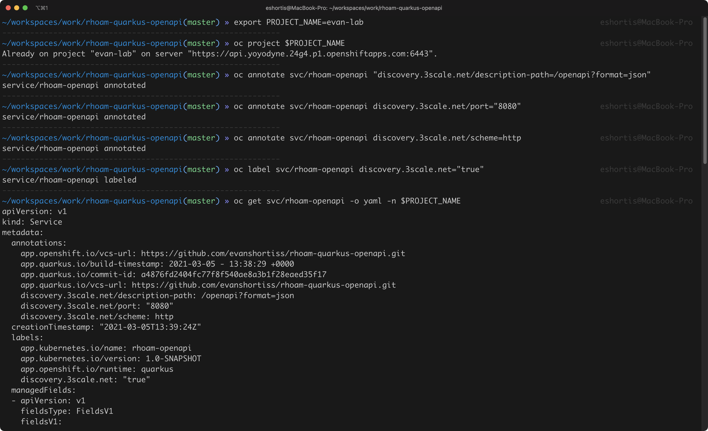
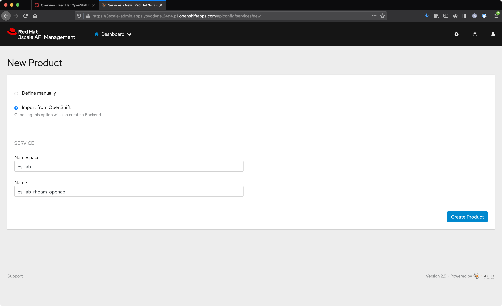
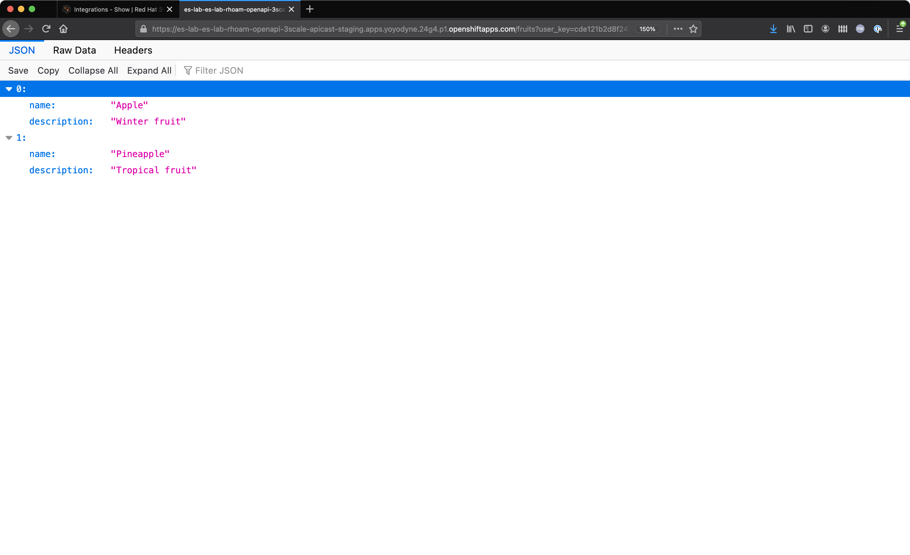

:standard-fail-text: Verify that you followed all the steps. If you continue to have issues, contact a workshop assistant.
:namespace: {user-username}
:idp: GitHub
:ocm-url: https://cloud.redhat.com
:osd-name: OpenShift Dedicated
:osd-acronym: OSD
:rhoam-name: Red Hat OpenShift API Management
:rhoam-acronym: RHOAM
:3scale-name: 3scale API Management
:project-var: $PROJECT_NAME
:base-api-svc-name: {project-var}-rhoam-openapi
:plan-pretty-name: {project-var} Test Plan
:plan-system-name: {project-var}-test-plan
:application-name: {project-var} Test Application

= Using Red Hat OpenShift API Management & Service Discovery

_Note: You must complete the *Red Hat OpenShift API Management Introduction* lab prior to starting this one._

During the previous lab you learned how to access the Red Hat {osd-name}, and the Red Hat {3scale-name} and Red Hat {sso-name} consoles that are provided by the {rhoam-acronym} addon. You also deployed a Quarkus application into your own project on the cluster.

In this lab you'll learn to manage your Quarkus API using {3scale-name}. Since the Quarkus API is running in the same cluster as {3scale-name} you can use the *Service Discovery* feature to import your Quarkus API into {3scale-name}.

== Prepare your Quarkus API for Service Discovery

A set of *labels* and *annotations* must be applied to your Quarkus API before {3scale-name} will be able to find it via *Service Discovery*.

To apply the necessary annotations:

. Navigate to the {osd-name} Console and login.
. Click your name in the top-right, then click *Copy Login Command*.
. Login using your IdP if prompted, and click *Display Token*.
. Copy the `oc login` command and paste it into a terminal in your local development environment.
. Enter the following commands to apply the annotations.
+
[subs="attributes+"]
----
oc project {project-var}
oc annotate svc/{base-api-svc-name} "discovery.3scale.net/description-path=/openapi?format=json"
oc annotate svc/{base-api-svc-name} discovery.3scale.net/port="8080"
oc annotate svc/{base-api-svc-name} discovery.3scale.net/scheme=http
----
. Add the discovery label using the following command.
+
[subs="attributes+"]
----
oc label svc/{base-api-svc-name} discovery.3scale.net="true"
----
. Verify the annotations and labels by viewing the service YAML.
+
[subs="attributes+"]
----
oc get svc/{base-api-svc-name} -o yaml
----

The YAML output will be similar to the example shown if the labels and annotations have been applied.

== Import your Quarkus API using Service Discovery

[NOTE]
====
After {3scale-name} users are assigned a restrictive read-only role by default. This means they cannot create, update, or delete API resources in {3scale-name}.

{osd-name} users with the link:https://docs.openshift.com/dedicated/4/administering_a_cluster/dedicated-admin-role.html[*dedicated-admin*, window="_blank"] role are provided with {3scale-name} admin permissions by default.

Reach out to your lab administrator to request increased access to the {3scale-name} instance if necessary. If you're the owner of the cluster in Red Hat OpenShift Cluster Manager you can personally upgrade your account to a dedicated-admin.
====

Log in to 3scale API Management using your configured IdP, and click the New Product link on the dashboard.
Perform the following steps on the New Product screen:

. Select Import from OpenShift (authenticate if necessary).
. Choose the namespace that contains your Quarkus API from the namespace dropdown.
. Choose the `{base-api-svc-name}` service from the Name dropdown.
. Click the *Create Product* button.

The *New Product* screen will resemble the following screenshot prior to clicking *Create Product*.

At this point, you should be redirected back to the 3scale API Management dashboard.
If your new API isn’t listed in the APIs section after a few moments, try refreshing the page.
Once the API has been imported and listed on the dashboard expand it and click the ActiveDoc link. Select `{base-api-svc-name}` on the subsequent screen to view the live documentation that was generated from the OpenAPI specification.

image::images/lab2-active-doc.png[3scale Active Docs, role="integr8ly-img-responsive"]

== Create an Application Plan in {3scale-name}

Next, you’ll need to configure an Application Plan to interact with the API via a protected route:

. Choose Product: `{base-api-svc-name}` from the top navigation bar.
. Select Applications > Application Plans from the menu on the left.
. Click the Create Application Plan link.
. Enter `{plan-pretty-name}` in the Name field, e.g `es-lab Test Plan`.
. Enter `{plan-system-name}` in the System name field, e.g `es-lab-test-plan`.
. Click the Create Application Plan button.
. Click the Publish link when redirected to the Application Plans screen.

The figure below shows the dialog to create a new application plan in 3scale API Management.

image::images/lab2-created-plan.png[3scale Application Plan, role="integr8ly-img-responsive"]

== Configure a Developer Account to use the Application

Now that you’ve created an Application Plan, you’ll need to sign up a developer account to use the application. Typically, an API consumer signs up using your API Developer portal. For the purpose of this lab, you will manually provide the default Developer account with API access:

. Select *Audience* from the top navigation bar.
. Select the *Developer* account from the Accounts list.
. Click the *(number) Applications* link from the breadcrumb links at the top of the screen.
. Click the *Create Application* link and you’ll be directed to the *New Application* screen.
. Select `{plan-pretty-name}` as the Application Plan.
. Enter `{application-name}` in the Name field.
. Enter a description of the API.
. Click Create Application.

Once the application is created, you’ll see that an API key is listed under the API Credentials section, as shown in the image below. Take note of the key.

image::images/lab2-created-application.png[3scale Application, role="integr8ly-img-responsive"]

== Test the API

At this point you can start making requests to your API via a HTTP client.

. Navigate back to the {base-api-svc-name} API Overview
. Open the Integration > Configuration section and scroll down to the Staging APIcast section.
. Copy the cURL command and add /fruits to the URL, e.g https://{base-api-svc-name}-api-3scale-staging.$CLUSTER_HOSTNAME:443/fruits?user_key=$YOUR_API_KEY
. Issue the command a few times, or paste the URL into a web browser. You should to receive a fruits response.

Congratulations, you've gotten your Quarkus API pushed into a Staging API Management environment!

You're ready to move onto Lab 3.
