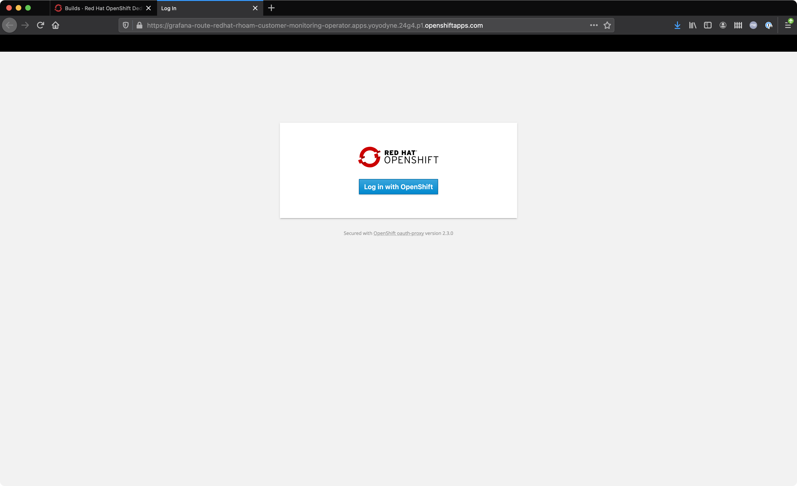
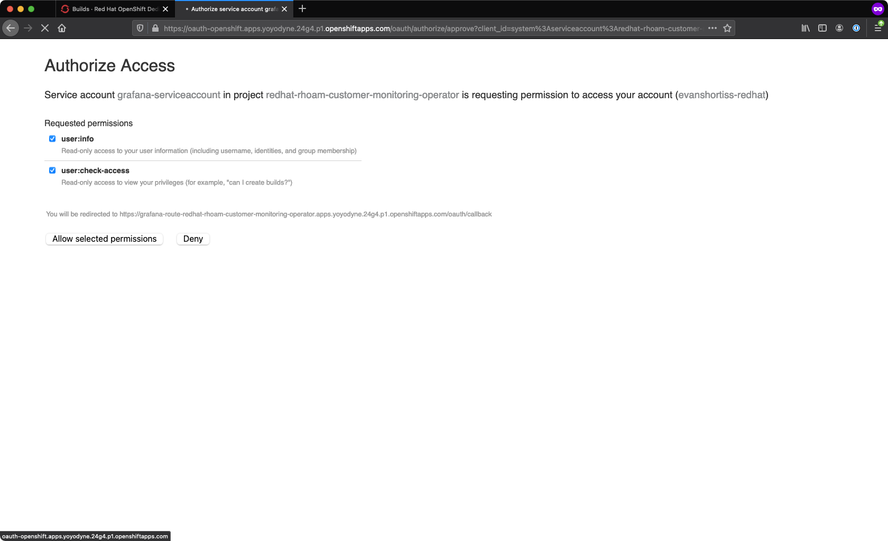
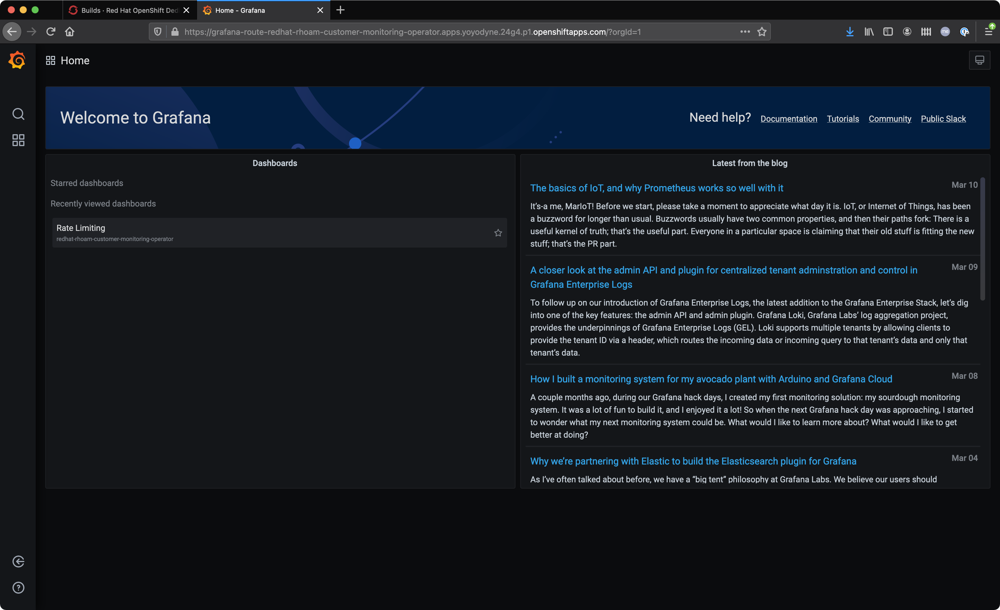
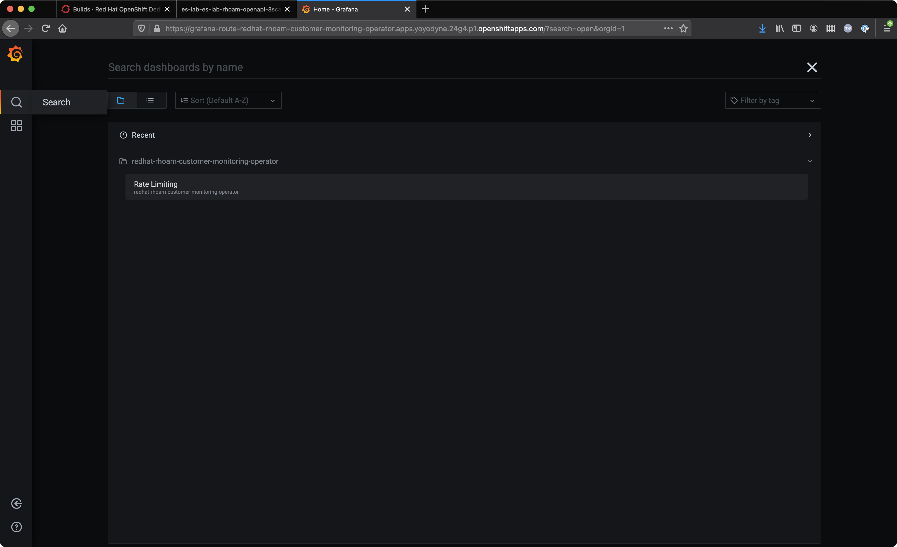
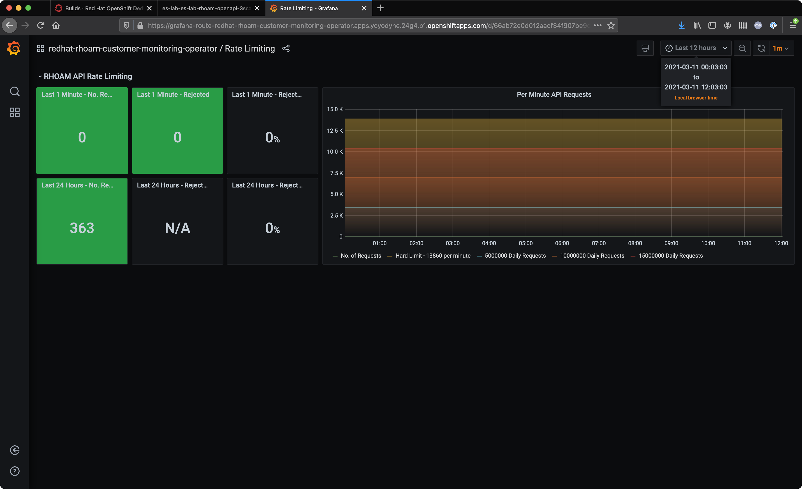
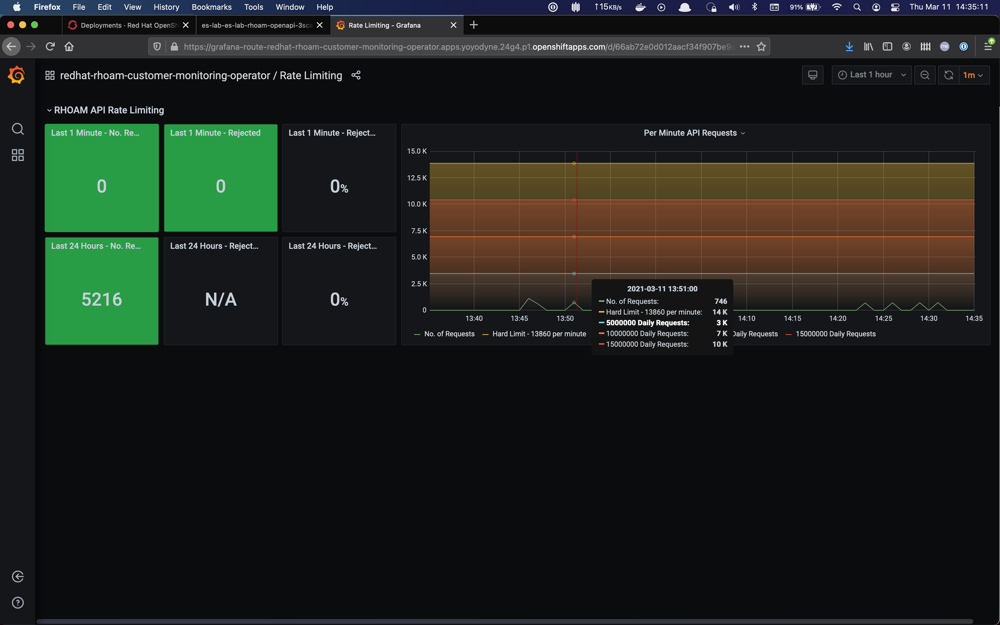
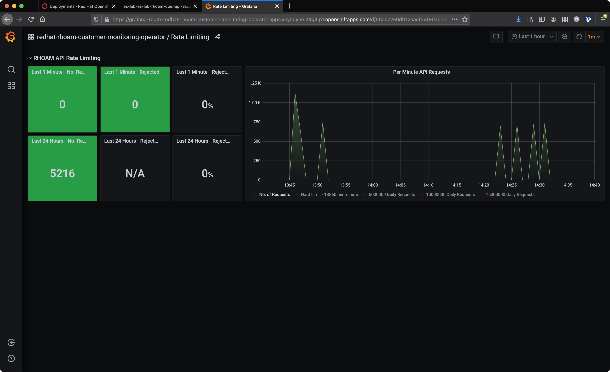

:standard-fail-text: Verify that you followed all the steps. If you continue to have issues, contact a workshop assistant.
:namespace: {user-username}
:idp: GitHub
:ocm-url: https://cloud.redhat.com
:osd-name: OpenShift Dedicated
:osd-acronym: OSD
:rhoam-name: Red Hat OpenShift API Management
:rhoam-acronym: RHOAM
:3scale-name: 3scale API Management
:project-var: $PROJECT_NAME
:base-api-svc-name: {project-var}-rhoam-openapi

= {rhoam-name} Rate Limit Monitoring

{rhoam-acronym} is a hosted and managed service, and a result:

. Various subscription levels are available.
. Subscription levels are segmented based on a maximum throughput.
. Throughput is measured in API calls per minute/day.

A Grafana "Rate Limiting" dashboard is provided with {rhoam-acronym} Customers can use this dashboard to determine where their usage stands with respect to the limits of their chosen subscription.

== Accessing the Grafana Monitoring Instance

[NOTE]
====
The Grafana Monitoring instance is only accessible by users that have been assigned the link:https://docs.openshift.com/dedicated/4/administering_a_cluster/dedicated-admin-role.html[*dedicated-admin*, window="_blank"] role on the {osd-name} cluster.

Reach out to your lab administrator to request elevating your permissions. If you're the owner of the cluster in Red Hat OpenShift Cluster Manager you can personally upgrade your account to a dedicated-admin.
====

. Navigate to the {osd-name} console and login.
. Click the *Application Launcher* icon in the {osd-name} console. This the square icon in the top-right.
. Select *API Management Dashboards* from the *Application Launcher* menu.
. A new browser tab will open and prompt you to login using OpenShift OAuth. Click the *Log in with OpenShift* button.
+

. Authenticate using your configured IdP.
. Authorize the account permissions request by choosing *Allow selected permissions*.
+

You should be redirected to a Grafana instance homepage after successfully authenticating and authorizing account access.

== Viewing the Grafana Monitoring Dashboard

Now that you're able to view the {rhoam-acronym} Rate Limiting Grafana instance, let's go ahead and get familiar with it.

. Navigate to the *API Management Dashboards* (Grafana) using the steps from the previous section.
. Login if prompted to do so.
. Click the *Search* icon on the left.
. Expand the `redhat-rhoam-customer-monitoring-operator` folder by clicking on it.
. A *Rate Limiting* entry should be listed similar to the screenshot below.
+

. Select *Rate Limiting* the *Dashboards* screen.

At this point you should be viewing the *RHOAM API Rate Limiting* Grafana dashboard.

== Using the Dashboard

=== The Basics

The *RHOAM API Rate Limiting* dashboard has useful information that includes:

. Tiles for the number of accepted/rejected requests received in the past:
.. Minute.
.. 24 hours.
. Tiles for the percentage of requests that were accepted/rejected in the past:
.. Minute
.. 24 hours.
. A graph showing historical data of *Per Minute API Requests*.

A rejected request is defined as a request that was attempted by a client, but rejected by {rhoam-name} with a link:https://developer.mozilla.org/en-US/docs/Web/HTTP/Status/429[HTTP 429, window="_blank"] due to the active subscription's rate limit being exceeded.

The following image shows a cluster that has minimal API activity - just 363 HTTP requests were processed by {3scale-name} in the past 24 hours.

=== Per Minute API Requests Graph

The *Per Minute API Requests Graph* does exactly what the name implies. It displays historical data for the number of requests processed by {3scale-name} in a given minute.

In the top-right you can filter the time range that is displayed for the *Per Minute API Requests* graph.
Data points for the *No. of Requests*, represented by the green line, is the number of requests processed in a given minute.

The following image displays an example of viewing data for a *Last 1 hour*. Notice how it has peaks of traffic followed by periods of inactivity.

The graph includes a few other useful lines that are in fixed positions. These lines represent important thresholds that you can use to gauge your API activity, and how close it is to exceeding your subscription limits. For example, a sustained rate of ~3K requests per minute will approach the limits of 50M requests per day subscription. The same applies for 7K per minute and a 10M requests per day subscription, etc.

=== Filtered Per Minute API Requests Graph

If you'd like to view *only* the requests per minute you can click the *No. of Requests* in the legend below the graph. The graph should change display mode similar to the example in the screenshot below.

This is useful to view requests per minute in isolation, since the fixed position metrics can skew the scaling.
