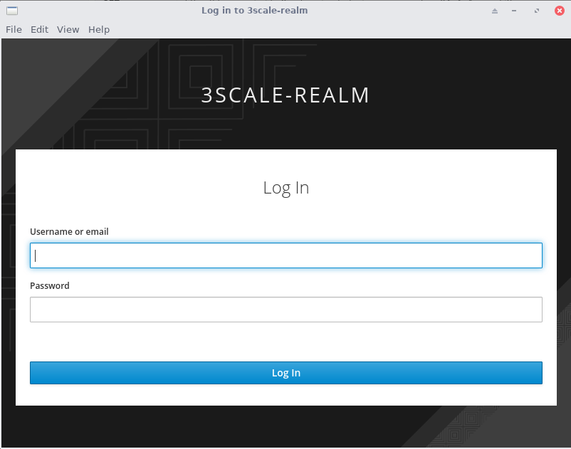

:osd-name: OpenShift Dedicated
:rhoam-name: Red Hat OpenShift API Management
:3scale-name: 3scale API Management
:sso-name: Red Hat Single Sign-On
:sso-name-short: RH-SSO

= Securing APIs with OpenID Connect and {sso-name}} on {rhoam-name}

In this lab you will learn how to secure an API managed with {3scale-name} using OpenID Connect (OIDC), using the {sso-name} instance of {rhoam-name} as identity provider.

== Create a Realm on {sso-name}

. Access the {sso-name-short} console through the *Application Launcher* in the {osd-name} console. This the square icon in the top-right.
. Select *API Management SSO* to access the {sso-name} console.
. Log in to the {sso-name-short} administration console. Login using your IdP.
. You are redirected to the overview page of the _Master_ realm.
+

. To create a new realm, hover over the realm drop-down in the menu and click the *Add realm* button.
+
image::images/lab4-sso-add-realm.png[SSO Add Realm, role="integr8ly-img-responsive"]
. Give a name to your realm, for example `3scale-realm`.
. Click the *Create* button to create the realm.
. You are redirected to the overview screen of your new realm.
+
image::images/lab4-sso-3scale-realm.png[SSO 3scale Realm, role="integr8ly-img-responsive"]
. The next step is to create a user for the realm. In the realm menu, select *Users*.
. On the users overview page, click the *Add user* button on the right to create a new user.
. Fill in the form. Click *Save* to create the user.
+
image::images/lab4-sso-add-user.png[SSO Add User, role="integr8ly-img-responsive"]
. Open the *Credentials* tab and set a password for the new user. Make sure *Temporary* is set to `OFF`. Click *Set Password* to save the password.
+

== 3scale and {sso-name} Integration

Every OIDC secured _application_ in 3scale needs a corresponding SSO client in the {sso-name-short} realm.
The details between the API managed _application_ should match the details of the corresponding SSO _client_.

Subsequently, it is important to automate the synchronization between 3scale and {sso-name-short}.

The _zync_ component in 3scale is the component responsible for this synchronization.
Its purpose is to synchronize API managed _applications_ to external systems such as {sso-name-short}.
It does so in an automated manner by pushing updates to external systems every time a state change occurs within an API managed _application_.

In this section, you create a SSO client in the realm of your {sso-name-short} server that will be leveraged by the _zync_ component of the 3scale API management platform.
Zync will use the new SSO client to synchronize between OIDC secured _applications_ and their corresponding SSO _clients_ in {sso-name-short}.

The name of this new SSO client will be called:  _zync-sso_.
The _zync-sso_ client will be configured to utilize the OIDC _client credentials_ flow.
Via the _zync-sso_ client, the zync component will retrieve an access token that then allows for the creation and update of new SSO clients through the {sso-name-short} API.

[NOTE]
====
Within OIDC and OAuth, the Client Credentials Flow is used for server-to-server scenarios. In this scenario, the client application (in our case the 3scale zync component) is a confidential client that’s acting on its own, not on behalf of the user. It’s more of a service account type of scenario. It’s a back channel flow to obtain an access token using the client’s credentials.
A good explanation of the different OIDC flows can be found here: https://developer.okta.com/blog/2017/06/21/what-the-heck-is-oauth
====

*Create _zync_sso_ client*

. In the {sso-name-short} console, make sure you are on the page of the realm you created in the previous step.
. Click *Clients* to open the realm clients overview page,
. Click *Create* to create a new realm client.
. In the _Add Client_ page, enter the following values:
* *Client ID*: `zync-sso`
* *Client Protocol*: `openid-connect`
* *Root URL*: leave blank
. Click *Save* to create the realm client.
. You are redirected to the client _Settings_ page.
. Make the following changes to the client settings:
* Set *Access Type* to `confidential`.
* Set *Standard Flow Enabled* to `OFF`.
* Set *Direct Access Grants Enabled* to `OFF`.
* Set *Service Accounts Enabled* to `ON`.
+
image::images/lab4-sso-client-settings-client-credentials.png[SSO Realm Client Settings For Client Credentials, role="integr8ly-img-responsive"]

. Scroll down and click *Save* to save the client configuration.
. Navigate to the *Service Account Roles* tab of the client settings.
. In the *Client Roles* dropdown, type `realm-management`.
. Ensure that the `manage-clients` role is listed as one of the *Assigned Roles*.
+

. Take note of the _Client ID_ - which is `zync-sso` unless you changed the value.
. Take note of the _Client Secret_. You can find the value of the Client Secret on the *Credentials* page of the client.
+

== Create API in {3scale-name} and Configure to Use OpenID Connect

In this section of the lab you configure an API on 3scale secured with OpenID Connect.

The backend for this new API is the Quarkus application which you leveraged in previous labs as well.

. Log in to {3scale-name} using your configured IdP.
. Navigate to *Dashboard*, select the *Products* tab and click *New Product*.
. On the _New Product_ page:
* Select *Define manually*
* *Name*: `RHOAM API OIDC`
* *System Name*: `rhoam_api_oidc`
. Select *Create Product* to create the API.
. Create an application plan for the new API:
* *Name*: `RHOAM OIDC Basic Plan`
* *System Name*: `rhoam_oidc/basic`
. Publish the application plan.
. Add a backend to the API. Click on the *Integration -> Backends* link in the menu. On the backend page, click *Add Backend*. Select the `rhoam-openapi Backend` backend, and set the path to `/`. Click *Add to Product* to add the backend to the API.
. The default mapping rules allow all `GET` operations, which is sufficient for this lab.
. On the *Settings* page of the API:
* Select `APIcast 3scale managed`.
* Leave the *Staging Public Base URL* and *Production Public Base URL* to the default values.
. In the *Authentication* section, select `OpenID Connect`.
. Scroll down and fill in the details for the authentication settings:
* *OpenID Connect Issuer Type*: `Red Hat Single Sign-On`
* Set the value of *OpenID Connect Issuer* to the URL of your realm on RH-SSO, to which you add the _zync_sso_ client ID and secret for authentication. +
+
-----
https://<ZYNC_SSO_CLIENT_ID>:<ZYNC_SSO_CLIENT_SECRET>@<RHSSO_HOSTNAME>/auth/realms/<SSO_REALM>
-----
+
** `<ZYNC_SSO_CLIENT_ID>`: client ID of the SSO client you created in the previous section. 
** `<ZYNC_SSO_CLIENT_SECRET>`: client secret of the SSO client you created in the previous section.
** `<RHSSO_HOSTNAME>`: Host name of the {sso-name-short} server. Something like `keycloak-redhat-rhoam-user-sso.apps.<OPENSHIFT_BASE_URL>`.
** `<SSO_REALM>`: name of the realm you created previously. 
+
[NOTE]
=====
This URL serves the following purposes:

* Provides zync with the URL to add or update SSO clients in RH-SSO.
* Provides APIcast with the URL to RH-SSO to retrieve the public key of the RH-SSO realm in order to verify the JWT token.
=====
* In the *OIDC AUTHORIZATION FLOW* section, ensure that the `Authorization Code Flow` checkbox is checked.
+
image::images/lab4-3scale-api-oidc-settings.png[3scale API OIDC Settings, role="integr8ly-img-responsive"]
* Scroll down and change *Credentials Location* to _As HTTP Headers_.
+
image::images/lab4-3scale-api-credentials-location.png[3scale API Credentials Location, role="integr8ly-img-responsive"]

. Click *Update Product* to update the settings.

== Create Application

In this section of the lab you create an application for the _RHOAM API OIDC_ API.

. Log in to {3scale-name} using your configured IdP.
. Navigate to *Audience -> Accounts -> Listing*, and click *Create* to create a new account.
. On the _Create New Account Page_, enter the following values:
* *Username*: `test-oidc`
* *Email*: a valid email address
* *Password*: an easy to remember password
* *Organization/Group Name*: `TestOIDC`
. Click *Create* to create the user and account.
. Create a new _Application_ for the TestOIDC account.
* *Application Plan*: `RHOAM OIDC Basic Plan`
* *Name*: `TestOIDC RHOAM App`
. On the overview page for the application, click *Edit* in the _API Credentials_ section.
. Set the redirect URL to `https://www.getpostman.com/oauth2/callback`.
+
image::images/lab4-3scale-api-oidc-callback-url.png[3scale API OIDC callback, role="integr8ly-img-responsive"]
+
* This redirect URL will become useful later in this lab when you test using the _Authorization Code_ OAuth2 flow.
* Notice that the API Credentials for this application do no consist of a user key, but rather a Client ID and a Client Secret.

== Verify Application Client in {sso-name-short}

As a result of creating the application, the 3scale zync component has created a new realm client for your realm in the {sso-name-short} server.

. Log in to RH-SSO, select the 3scale realm and navigate to the *Clients* section.
. Notice that a new client has been created with a client ID corresponding to the client ID of the _TestOIDC RHOAM App_ application in 3scale.
+
image::images/lab4-sso-zync-client-created.png[RH-SSO Client created by Zync, role="integr8ly-img-responsive"]
. Click the *Edit* button for the new client.
* The client name corresponds to the name of the application in 3scale.
* The redirect URL matches the URL you specified in the API credentials.
* _Standard Flow_ is enabled, which matches the _Authorization Code Flow_ setting specified in the API definition.

== Test the OIDC Secured API

=== Promote to Staging and Production APIcast

. In the 3scale Admin Portal, navigate to *Product: RHOAM API OIDC -> Integration -> Configuration*.
. Promote the API to the staging and production APIcast.

=== Test the API with Authorization Code flow.

*Install and Configure Postman*

. Install Postman on your local workstation if you don't have it installed yet. Navigate to `https://www.postman.com/downloads/` and download the version matching your OS. At the moment of writing the latest version is 8.2.1. Untar or unzip the downloaded archive, and add the `Postman` binary to your PATH. Verify that the installation was successful. The response of the `which` command should point to the Postman executable binary.
+
----
$ which Postman
----

. Open the Postman application. If this is the first time you used Postman, expect to be greeted with a sign-up page. Feel free to skip this stage and go directly to the application.
+
image::images/lab4-postman-signup-page.png[Postman Signup Page, role="integr8ly-img-responsive"]

. Expect to see the landing page of the Postman application:
+

. Click *Create a request*.

. Enter the URL to the production APIcast of the _RHOAM API OIDC_ application in the *Enter request URL* text box. Add the `/fruits` path to the URL.
+
The APIcast URL can be obtained from the _Configuration_ page of the API in the {3scale-name} console.

. Click *Send*.
. Expect a `403 Forbidden` return code, and a response `Authentication parameters missing`.
+
image::images/lab4-postman-response-forbidden.png[Postman Response Forbidden, role="integr8ly-img-responsive"]

. Configure Postman to obtain an access token from the RH-SSO server.
.. Click the *Authorization* tab.
.. From the *Type* field, select *OAuth 2.0*.
.. Enter the following values into the *Configure New Token* dialog box:
* *Token Name*: `RHOAM API Access Token`
* *Grant Type*: `Authorization Code`
* *Callback URL*: `https://www.getpostman.com/oauth2/callback`
* *Auth URL*: `https://<RHSSO_HOSTNAME>/auth/realms/<SSO_REALM>/protocol/openid-connect/auth`
* *Access Token URL*: `https://<RHSSO_HOSTNAME>/auth/realms/<SSO_REALM>/protocol/openid-connect/token`
* *ClientID*: The value of the Client ID of the Application you created for the API.
* *Client Secret*: The value of Client Secret of the Application you created for the API.
* *Scope* : `openid`
* *Client Authentication* : `Send as Basic Auth header`
+
image::images/lab4-postman-configure-new-token.png[Postman Configure New Token, role="integr8ly-img-responsive"]

. Click *Get New Access Token*.
* A new dialog box appears that shows the login screen for your realm on the RH-SSO server.
+

. Enter the username and password of the realm user you created previously. Click *Log In*.

. A new pop-up appears that shows the details of the Access Token that was obtained from the RH-SSO server.
+
Click *Use Token*
+
image::images/lab4-postman-use-token.png[Postman Use Token, role="integr8ly-img-responsive"]

. Back on the request page, click *Send*. +
This time expect a successful response.
+
image::images/lab4-postman-response-ok.png[Postman Response OK, role="integr8ly-img-responsive"]

Congratulations, you've secured your API on {rhoam-name} with {sso-name} and OpenID Connect!