:rhoam-name: Red Hat OpenShift API Management
:3scale-name: 3scale API Management
:3scale-toolbox: 3scale toolbox

= Use {3scale-toolbox} with {rhoam-name}

The _{3scale-toolbox}_ is a command line interface (CLI) for the {3scale-name} platform. The aim of the {3scale-toolbox} is to help administrators operate their APIs, and to help them automate the delivery of these APIs through Continuous Delivery pipelines.

Compared to the RESTful 3scale admin APIs, the {3scale-toolbox} has a coarser granularity and as such is easier and less verbose to work with than using directly the fine-grained 3scale admin APIs.

The {3scale-toolbox} follows the usual conventions from CLIs:

* Output a non-zero status code on error.
* _stderr_ contains error messages; _stdout_ contains useful output.
* The output can be JSON or YAML, making it easy to be parsed by scripts or pipelines.

Another characteristic of the {3scale-toolbox} is that most operations are idempotent. This means you can express the desired state of the system and the {3scale-toolbox} will act accordingly: update the existing configuration if it exists, create it when it is missing. Idempotency greatly helps building more reliable automation tools in case of an outage or transient perturbation.

The {3scale-name} is written in Ruby. It is a wrapper around the 3scale APIs.

== Installation and Usage of {3scale-toolbox}

The officially supported method of installing the {3scale-toolbox} is using the {3scale-toolbox} container image, and use `docker` or `podman` to run the container. This avoids to having to install a Ruby runtime on your workstation.

However, there are are also alternative, albeit unsupported, ways to install and run the toolbox on different target platforms, including RHEL/CentOS/Fedora, Mac and Windows. Please refer to https://github.com/3scale-labs/3scale_toolbox_packaging for installation instructions.

In this lab you will run the {3scale-toolbox} with Podman or Docker (on a Mac).

[NOTE]
====
The instructions in this lab assume you have installed Podman on your workstation. If you want to use Docker instead, substitute `podman` with `docker` in the commands.
====

To download the {3scale-toolbox} image, you need a Red Hat Customer Portal account.

. Log in to the Red Hat Ecosystem Catalog (registry.redhat.io):
+
----
$ podman login registry.redhat.io
Username: <REDHAT_CUSTOMER_PORTAL_ACCOUNT_USERNAME>
Password: <REDHAT_CUSTOMER_PORTAL_ACCOUNT_PASSWORD>
Login Succeeded!
----
. Pull the toolbox container image. The version of the image needs to match the version of the {3scale-name} platform:
+
----
$ podman pull registry.redhat.io/3scale-amp2/toolbox-rhel7:3scale2.10
----
. Verify the installation:
+
----
$ podman run --rm registry.redhat.io/3scale-amp2/toolbox-rhel7:3scale2.10 3scale help
----
+
.Expected Output
----
NAME
    3scale - 3scale toolbox

USAGE
    3scale <sub-command> [options]

DESCRIPTION
    3scale toolbox to manage your API from the terminal.

COMMANDS
    account              account super command
    activedocs           activedocs super command
    application          application super command
    application-plan     application-plan super command
    backend              backend super command
    copy                 copy super command
    help                 show help
    import               import super command
    method               method super command
    metric               metric super command
    policy-registry      policy-registry super command
    product              product super command
    proxy-config         proxy-config super command
    remote               remotes super command
    service              services super command
    update               [DEPRECATED] update super command

OPTIONS
    -c --config-file=<value>      3scale toolbox configuration file (default:
                                  /opt/app-root/src/.3scalerc.yaml)
    -h --help                     show help for this command
    -k --insecure                 Proceed and operate even for server
                                  connections otherwise considered insecure
    -v --version                  Prints the version of this command
       --verbose                  Verbose mode
----

== Create API resources with {3scale-toolbox}

In this section of the lab, you use the 3scale toolbox to create API resources on 3scale in a programmatic way.

You will use the same Quarkus application which you leveraged in previous labs as well.

=== Manage remote access credentials

To be able to interface with the {3scale-name} platform, the {3scale-toolbox} requires an access token and the URL to the 3scale admin portal.

3scale has two types of tokens: access tokens (created by the user) and service tokens (automatically created when a new service is deployed in 3scale).

Access tokens allow API provider admins and members to authenticate against the 3scale admin APIs – Billing, Account Management, and Analytics.

An access token may provide either read and write access, or read only.

Access tokens work according to the member’s rights. Admins can create tokens to authenticate against all three 3scale APIs. Members will be limited by their permissions to access the different parts of the Admin Portal. For example, if a member does not have access to the Billing area, they will not be able to create a token to authenticate against the Billing API.

Tokens are not stored on 3scale. Once created, the token cannot be recovered from 3scale. In case the value is lost, the token needs to be deleted to invalidate it, and a new one created.

In this section of the lab you create an access token for the 3scale admin APIs.

. Log in to {3scale-name} using your configured IdP.
. Navigate to *Account Settings* by clicking on the  icon on the right of the top menu bar.
. On the _Account Settings Overview_ page, navigate to *Personal -> Tokens*.
. On the _Access tokens_ page, click *Add Access Token* to create a new access token.
+
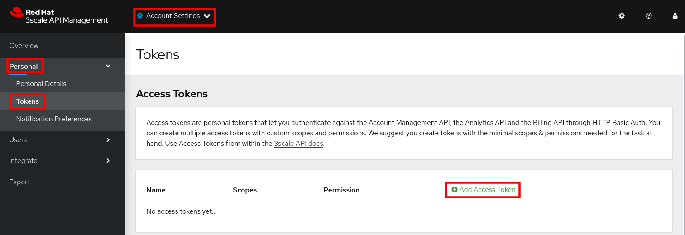
. On the _New Access Token_ page, enter the following values:
* *Name*: `admin token`
* *Scopes*: check `Account Management API`, `Analytics API`, `Policy Registry API`.
* *Permission*: `Read & Write`
+
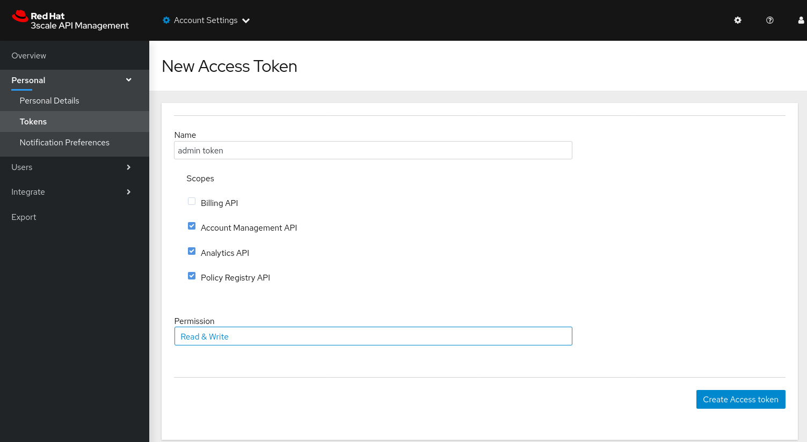
* Click *Create Access token* to create the token.
* On the next page, copy the value of the token, and click *I have copied the token*.

The access token and URL can be passed with every toolbox command in the format `https://<ACCESS TOKEN>@<3SCALE_HOSTNAME>`.

But to make working with the toolbox easier, the remote access credentials can also be added to the toolbox image.

. Add the remote credentials to the {3scale-toolbox} image. Here you use `rhoam` as identifier for the credentials. Replace `<ACCESS_TOKEN>` with the value of the token you created in the previous section, and <3SCALE_HOSTNAME> with the host name of the {3scale-name} platform.
+
----
$ podman run --name toolbox-container registry.redhat.io/3scale-amp2/toolbox-rhel7:3scale2.10 3scale remote add rhoam https://<ACCESS_TOKEN>@<3SCALE_HOSTNAME>
----
. Commit the image in a new image that includes the remote access credentials.
+
----
$ podman commit toolbox-container toolbox
----
. For the remainder of the lab you can use the newly created `toolbox` image to access the remote {3scale-name} instance. For example, to list the _Services_ defined on the {3scale-name} instance:
+
----
$ podman run --rm toolbox 3scale service list rhoam
----
+
.Sample Output
----
ID      NAME    SYSTEM_NAME
2       API     api
21      rhoam-openapi   btison-lab-rhoam-openapi
22      RHOAM API OIDC  rhoam_api_oidc
----
+
[NOTE]
====
Storing secrets for toolbox in a container is a potential security risk, for example when distributing the container with secrets to other users or using the container for automation.
In this lab you use it mostly for convenience purposes.
In real world environments you should use secured volumes in Podman or OpenShift secrets (if running a CI/CD pipeline on OpenShift for example).
====
. At any time you can use the `help` function of the toolbox to get more details about a command.
For example, to get help about the `import openapi` command:
+
----
$ podman run toolbox 3scale import openapi --help
----
+
.Output
----
NAME
    openapi - Import API definition in OpenAPI specification from a local file or URL

USAGE
    3scale import openapi [opts] -d <destination> <spec>
    (/path/to/your/spec/file.[json|yaml|yml] OR
    http[s]://domain/resource/path.[json|yaml|yml])

DESCRIPTION
    Using an API definition format like OpenAPI, import to your 3scale API
    directly from a local OpenAPI spec compliant file or a remote URL

OPTIONS
       --activedocs-hidden                        Create ActiveDocs in hidden
                                                  state
       --backend-api-host-header=<value>          Custom host header sent by
                                                  the API gateway to the
                                                  backend API
       --backend-api-secret-token=<value>         Custom secret token sent by
                                                  the API gateway to the
                                                  backend API
    -d --destination=<value>                      3scale target instance.
                                                  Format:
                                                  "http[s]://<authentication>@3scale_domain"
       --default-credentials-userkey=<value>      Default credentials policy
                                                  userkey
       --oidc-issuer-endpoint=<value>             OIDC Issuer Endpoint
       --override-private-base-url=<value>        Custom private base URL
       --override-private-basepath=<value>        Override the basepath for
                                                  the private URLs
       --override-public-basepath=<value>         Override the basepath for
                                                  the public URLs
       --prefix-matching                          Use prefix matching instead
                                                  of strict matching on
                                                  mapping rules derived from
                                                  openapi operations
       --production-public-base-url=<value>       Custom public production
                                                  URL
       --skip-openapi-validation                  Skip OpenAPI schema
                                                  validation
       --staging-public-base-url=<value>          Custom public staging URL
    -t --target_system_name=<value>               Target system name

OPTIONS FOR IMPORT
    -c --config-file=<value>                      3scale toolbox
                                                  configuration file
                                                  (default:
                                                  /opt/app-root/src/.3scalerc.yaml)
    -h --help                                     show help for this command
    -k --insecure                                 Proceed and operate even
                                                  for server connections
                                                  otherwise considered
                                                  insecure
    -v --version                                  Prints the version of this
                                                  command
       --verbose                                  Verbose mode
----

=== Import OpenAPI Spec

The {3scale-toolbox} allows you to import an OpenAPI specification document for an API. The OpenAPI specification will be introspected and based upon its structure a number of API artifacts will be created on {3scale-name}, including a product, backend, mapping rules and various settings.

In this lab you import the OpenAPI specification for the Quarkus application you used in previous labs. The OpenAPI specification is structured a bit differently compared to the version which is served by the application.

. Review the OpenAPI specification at https://raw.githubusercontent.com/btison/rhoam-introductory-labs/master/etc/fruits-api.json. Note the following:
* The document contains a `SecurityScheme`, specifying that an API Key is expected in a header with name `user_key`.
+
----
    "securitySchemes": {
      "ApiKeyAuth": {
        "type": "apiKey",
        "in": "header",
        "name": "user_key"
      }
    }
----
* The document has a single `servers.url` element. The `server.url` element’s path component (`/`) is used as the OpenAPI’s `basePath` property.

. Import the OpenAPI document into 3scale using the 3scale toolbox:
+
----
$ export PROJECT_NAME=<project where you deployed the Quarkus application>
$ podman run --rm toolbox 3scale import openapi \
    -d rhoam \
    https://raw.githubusercontent.com/btison/rhoam-introductory-labs/master/etc/fruits-api.json \
    --target_system_name rhoam-api-toolbox \
    --override-public-basepath=/v1 \
    --override-private-base-url=http://rhoam-openapi.$PROJECT_NAME.svc:8080
----
* `target-system-name` specifies the system name that is used for the _Product_ and _Backend_ that will be created.
* `--override-public-basepath` specifies the base path for the exposed API. For the sake of this exercise you decide to expose the API using the `/v1` base path, rather than the `/` base path defined in the OpenAPI document.
* `--override-private-base-url` specifies the private base URL for the API. This URL points to the Quarkus application deployed on OpenShift.
* The output of the 3scale toolbox command looks like:
+
.Sample Output
----
Created service id: 23, name: Fruits API
Service proxy updated
destroying all mapping rules
Created GET /v1/fruits$ endpoint
Created POST /v1/fruits$ endpoint
Created DELETE /v1/fruits$ endpoint
Service policies updated
----

. Navigate to the 3Scale Admin Portal and review the API resources created by the 3scale toolbox command. These include:
* An _API Product_ `Fruits API`. The name corresponds to the name in the OpenAPI spec.
+
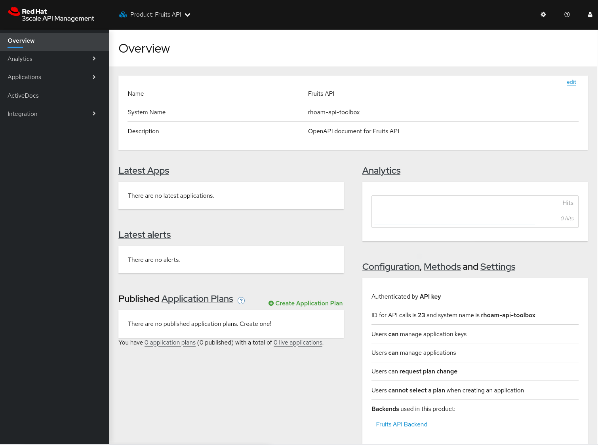
* A _Backend_ `Fruits API Backend`.
+

* API Product Settings including the Public Base URLs, and authentication settings (API Key as `user_key` HTTP header)
+
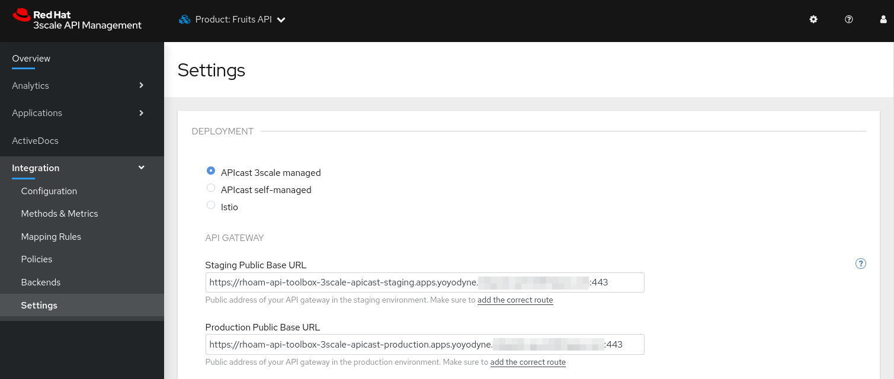
+
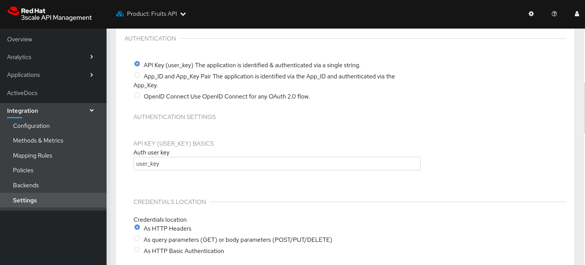
* Mapping Rules for the 3 operations defined in the OpenAPI specification.
+
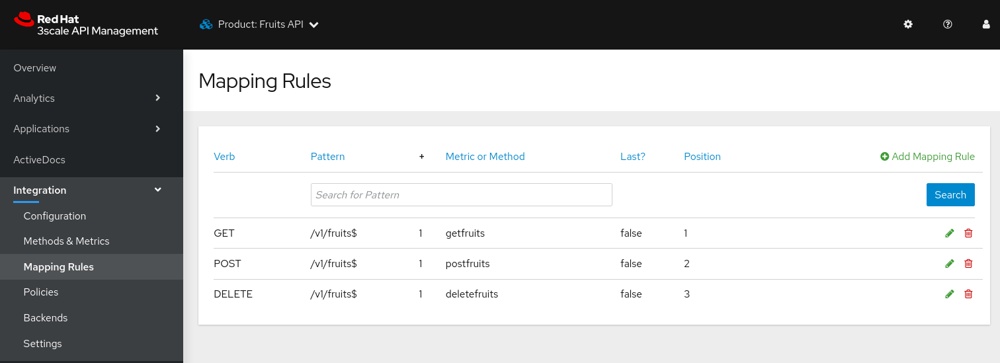
+
Note that the relative URLs of the mapping rules follow the specified public basepath.
* Methods for the 3 operations defined in the OpenAPI specification.
+
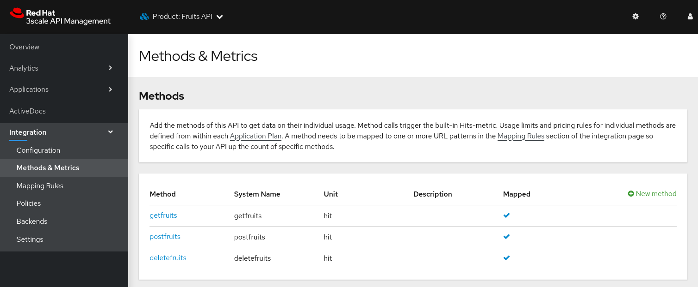
* A _URL Rewriting_ policy.
+
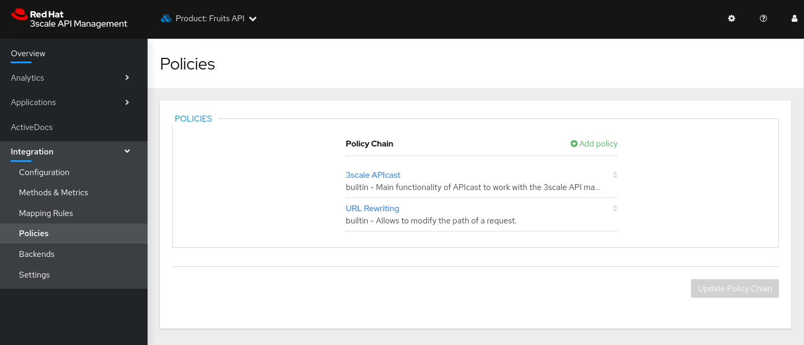
+
This policy translates the public base path of the URL (`/v1`) to the base path of the backend application (`/`).
+
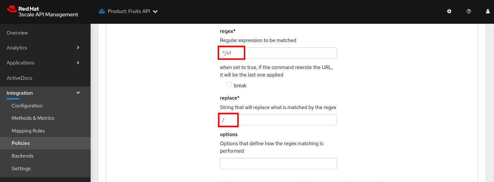
* ActiveDocs for the API.
+
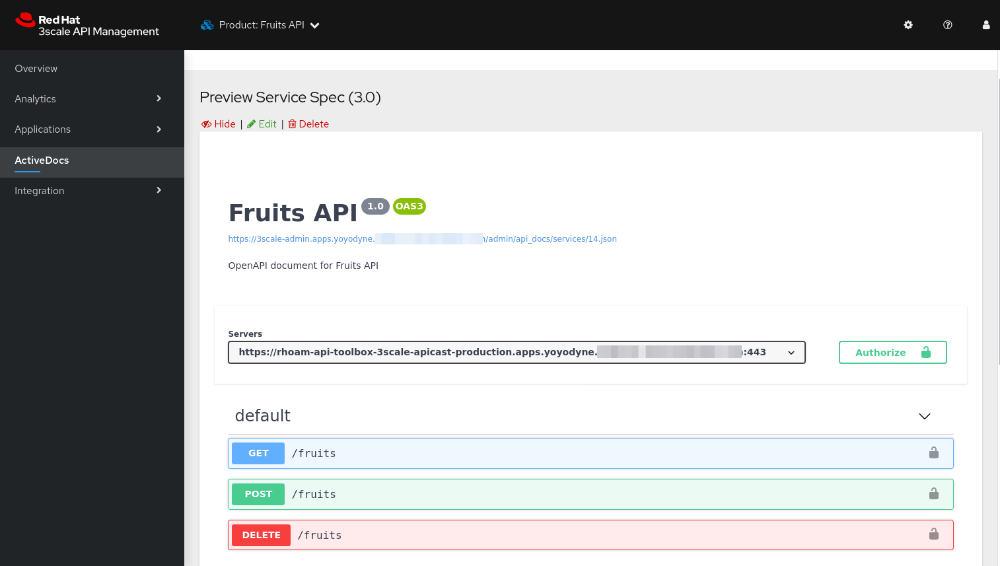

. You can change the name of the generated _Product_.
+
----
$ podman run --rm toolbox 3scale service apply rhoam rhoam-api-toolbox --name="Fruits API V1"
----
+
On the 3scale Admin Portal this becomes:
+
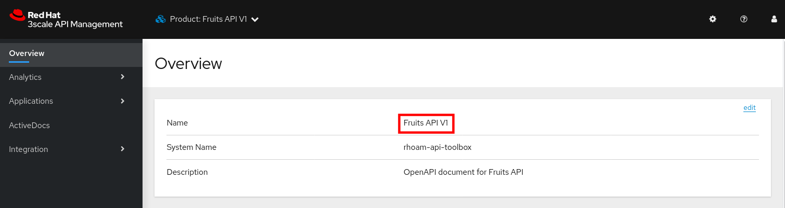

=== Create an Application Plan

The next step in deploying the API is defining one or more application plans.

. Create an application plan:
+
----
$ podman run --rm toolbox 3scale application-plan apply rhoam rhoam-api-toolbox rhoam-api-toolbox/basic -n "Fruits API Basic Plan" --default --publish
----
+
.Sample output
----
Applied application plan id: 36; Default: true; Published
----
+
On the 3scale Admin Portal:
+
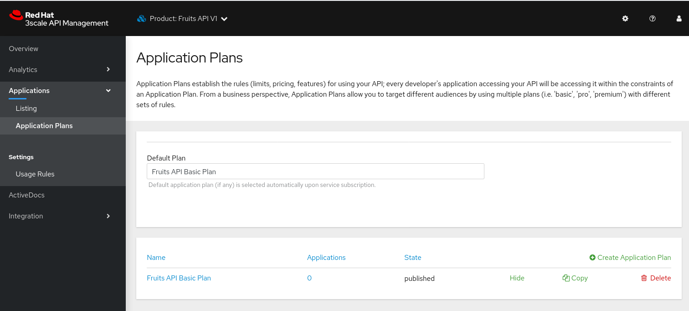

. The toolbox also allows to export or import an application plan definition in _yaml_ format. This allows to define more complex application plans including limits and pricing rules. +
As an example, you can update the application plan created in the previous step to exclude `POST` and `DELETE` operations.
* Create a file with the application plan definition:
+
----
$ echo "
---
plan:
  name: Fruits API Basic Plan
  state: published
  setup_fee: 0.0
  cost_per_month: 0.0
  trial_period_days: 0
  cancellation_period: 0
  approval_required: false
  system_name: rhoam-api-toolbox/basic
limits:
- period: eternity
  value: 0
  metric_system_name: postfruits
- period: eternity
  value: 0
  metric_system_name: deletefruits
" | tee /tmp/application-plan.yml
----
* Import the definition file with the 3scale toolbox. The file you just created is mounted into the toolbox container:
+
----
$ podman run --rm -v /tmp/application-plan.yml:/tmp/application-plan.yml toolbox 3scale application-plan import --file=/tmp/application-plan.yml rhoam rhoam-api-toolbox
----
+
.Sample output
----
Application plan updated: 55
Created plan limit: [metric: 59, {"period"=>"eternity", "value"=>0}]
Created plan limit: [metric: 60, {"period"=>"eternity", "value"=>0}]
----
* On the 3scale Admin Portal:
+
image::images/lab5-3scale-toolbox-update-application-plan.png[3scale toolbox update application plan, role="integr8ly-img-responsive"]

=== Create an Application

To create an application, an application plan is combined with an account and a service.
At this moment the toolbox does not allow to create accounts, so you will use an existing account for the application.

. Create an application for the `Developer` account:
+
----
$ podman run --rm toolbox 3scale application apply rhoam  1234567890abcdef --account=john --name="Fruits V1" --plan=rhoam-api-toolbox/basic --service=rhoam-api-toolbox
----
+
* `1234567890abcdef` is the user_key for this application
* `john` is the username of the admin user of the account. The account can be referenced by the account ID, or the username, email, or user_id of the admin user of the account.

. Verify the existence of the Application on the 3scale Admin Portal:
+
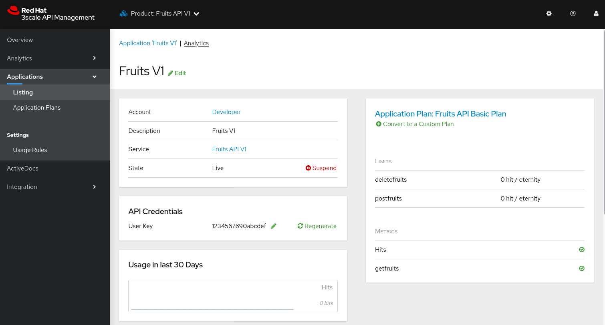

. At this point you can test the API on the staging APIcast:
+
----
$ curl -v -X GET -H "Accept: application/json" -H "user_key: 1234567890abcdef" https://rhoam-api-toolbox-3scale-apicast-staging.apps.<OPENSHIFT_BASE_URL>/v1/fruits
----
+
.Expected Response
----
*   Trying 34.205.xxx.xxx:443...
* Connected to rhoam-api-toolbox-3scale-apicast-staging.apps.yoyodyne.xxx.yyy (34.205.xxx.xxx) port 443 (#0)
[...]]
> GET /v1/fruits HTTP/1.1
> Host: rhoam-api-toolbox-3scale-apicast-staging.apps.yoyodyne.xxx.yyy
> User-Agent: curl/7.71.1
> Accept: application/json
> user_key: 1234567890abcdef
> 
* Mark bundle as not supporting multiuse
< HTTP/1.1 200 OK
< server: envoy
< date: Sat, 10 Apr 2021 16:30:48 GMT
< content-type: application/json
< content-length: 99
< x-envoy-upstream-service-time: 129
< set-cookie: e5891a1fea7fd54d219ace35f200347d=94ac67ae4f1c90456f1481a5227e5f11; path=/; HttpOnly; Secure; SameSite=None
< cache-control: private
< 
* Connection #0 to host rhoam-api-toolbox-3scale-apicast-staging.apps.yoyodyne.xxx.yyy left intact
[{"name":"Apple","description":"Winter fruit"},{"name":"Pineapple","description":"Tropical fruit"}]
----

. If the call to the staging APIcast succeeds, you can promote the API to production:
+
----
$ podman run toolbox 3scale proxy-config promote rhoam  rhoam-api-toolbox
----
+
.Sample output
----
Proxy Configuration version 4 promoted to 'production'
----

. Test the API on the production APIcast:
+
----
$ $ curl -v -X GET -H "Accept: application/json" -H "user_key: 1234567890abcdef" https://rhoam-api-toolbox-3scale-apicast-production.apps.<OPENSHIFT_BASE_URL>/v1/fruits
----

You have successfully deployed an API on 3scale using the 3scale toolbox.