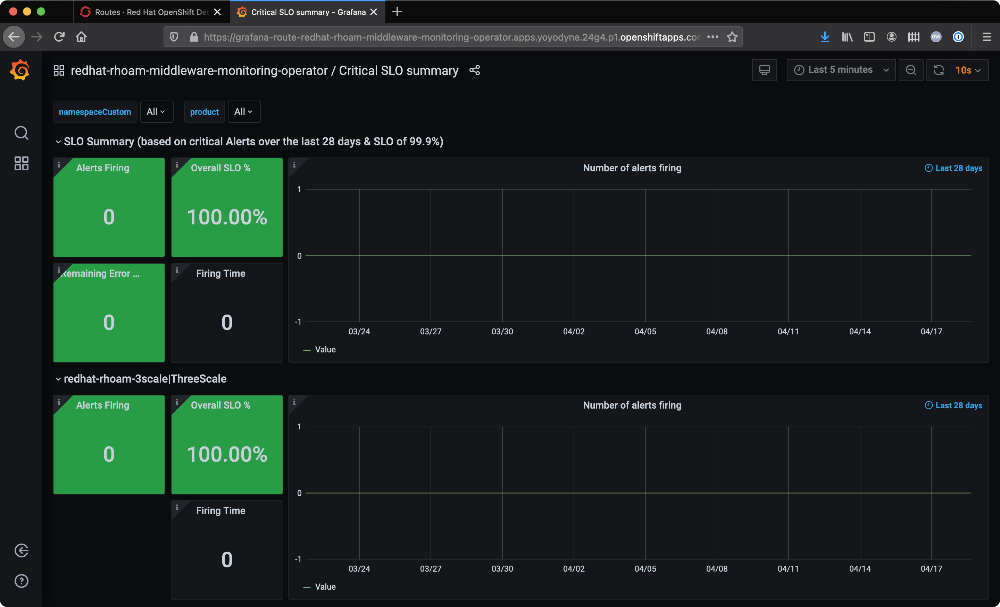
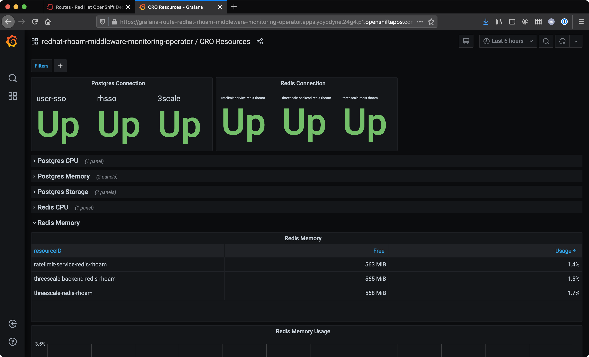
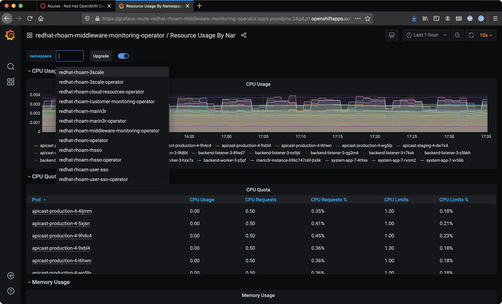
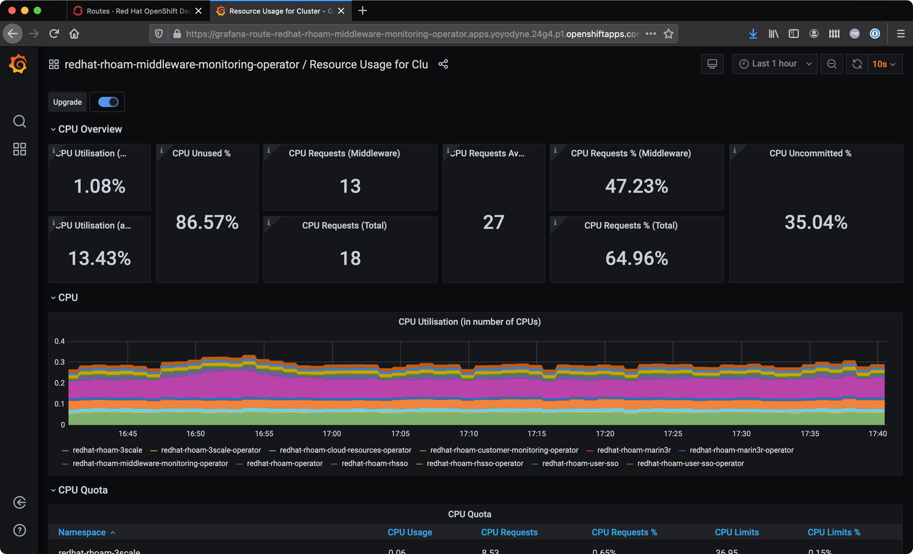

:standard-fail-text: Verify that you followed all the steps. If you continue to have issues, contact a workshop assistant.
:namespace: {user-username}
:idp: GitHub
:ocm-url: https://cloud.redhat.com
:osd-name: OpenShift Dedicated
:osd-acronym: OSD
:rhoam-name: Red Hat OpenShift API Management
:rhoam-acronym: RHOAM
:3scale-name: 3scale API Management
:project-var: $PROJECT_NAME
:base-api-svc-name: {project-var}-rhoam-openapi
:mw-monitor-ns: redhat-rhoam-middleware-monitoring-operator

= {rhoam-name} 3scale and {osd-name} Cluster Monitoring

Both {rhoam-name} and {osd-name} include a monitoring stack out of the box.

[NOTE]
====
Monitoring resources can only be viewed by OpenShift user accounts that have *dedicated-admin* or *cluster-admin* permissions.
====

== Accessing the Middleware Monitoring Stack

. Navigate to the {osd-name} console for your cluster and login as a *dedicated-admin* user.
. Select the *Administrator* perspective from the side-menu.
. Expand the *Networking* entry in the side-menu and select *Routes*.
. Choose the `{mw-monitor-ns}` from the *Project* dropdown.
. The following routes should be listed, similar to the screenshot.
.. Grafana
.. Prometheus
.. Alertmanager

image::images/lab-6-mw-monitor-routes.png[Middleware Monitoring Routes]

=== Accessing the Grafana Dashboards

. Click the URL that corresponds to the Grafana service.
. A new browser tab will open and prompt you to login using OpenShift OAuth. Click the *Log in with OpenShift* button.
. Authenticate using your configured IdP.
. Authorize the account permissions request by choosing *Allow selected permissions*.

You should be redirected to a Grafana instance homepage after successfully authenticating and authorizing account access.

. Hover over the tile icon on the left and select *Manage*.
. Select the *List* view icon.

All the dashboards that are available to you should be listed, similar to the following image.

image::images/lab-6-grafana-dashboards.png[Grafana Dashboards]

The *Critical SLO summary* dashboard provides the viewer with information relating to Service Level Objectives. Specifically, it indicates the availability of {rhoam-acronym} components are within the overall SLA agreement.

The *CRO Resources* dashboard provides a view of CPU and Memory metrics, and the status of underlying cloud resources. Postgres and Redis are two such cloud resources, and are provided by the underlying cloud vendor, e.g AWS ElastiCache for Redis.

=== Viewing Managed Service Resource Usage

. Open the {osd-name} console for your cluster and login as a *dedicated-admin* user.
. Navigate to the *Routes* screen in the *{mw-monitor-ns}* Project.
. Open the Grafana Route and navigate to the dashboards list.
. Select the *Resource Usage by Namespace* dashboard.
. Click the *namespace* dropdown.
+

. Choose the *redhat-rhoam-3scale* entry.

This view can be used to monitor CPU and Memory usage by APIcast, Zync, and other {3scale-name} Pods.

To view the resource usage of the Managed Service components with respect to overall cluster resource usage/availability:

. Open the {osd-name} console for your cluster and login as a *dedicated-admin* user.
. Navigate to the *Routes* screen in the *{mw-monitor-ns}* Project.
. Open the Grafana Route and navigate to the dashboards list.
. Select the *Resource Usage for Cluster* dashboard.

